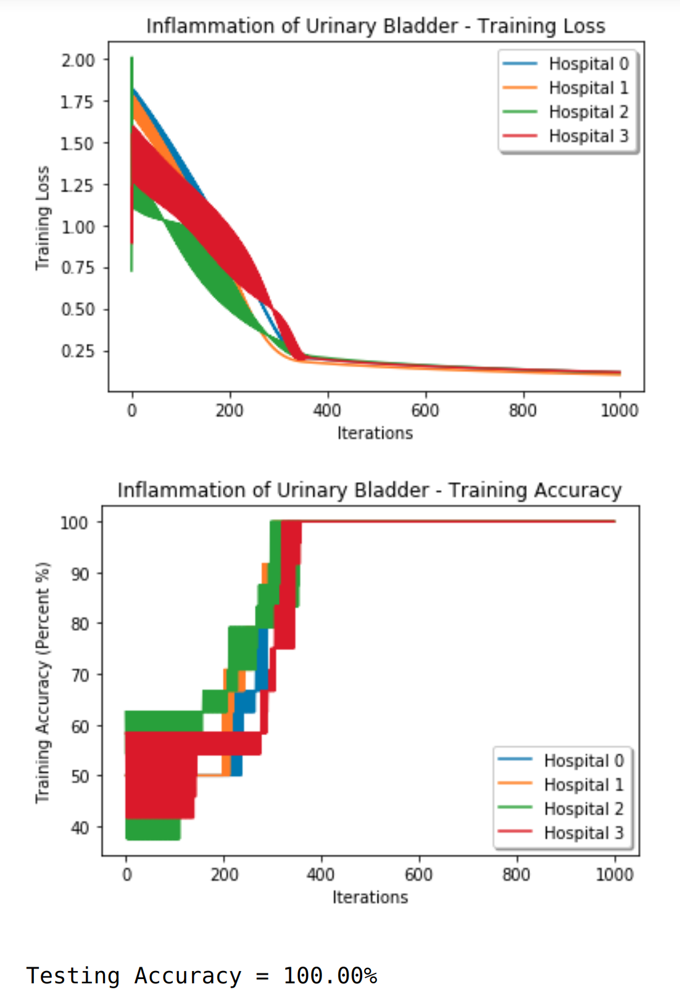
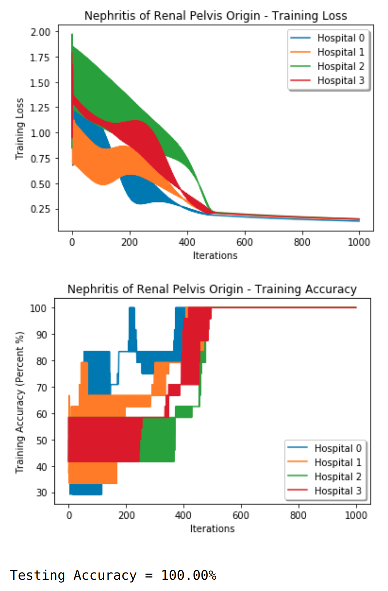
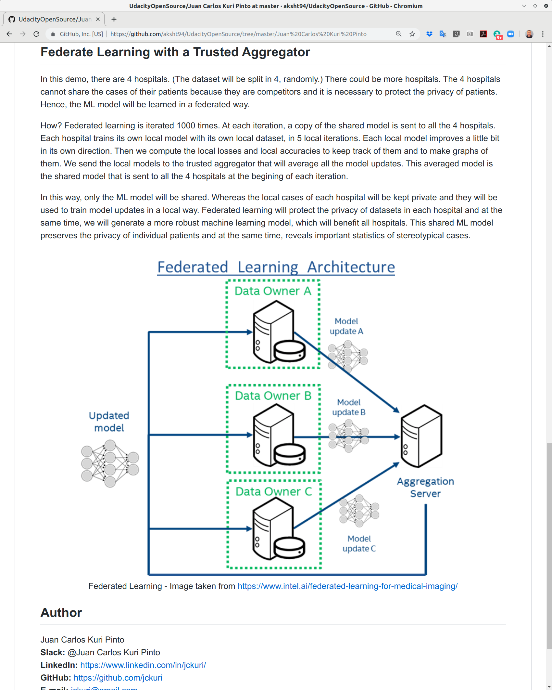

# \#60daysofudacity
**My daily activities for the #60daysofudacity pledge of the Secure and Private AI Scholarship Challenge with Facebook.**

:trumpet: *DAY 1 of 60:* #60daysofudacity #UdacityFacebookScholar<br/>
:heavy_check_mark: Took the #60daysofudacity pledge.<br/>
:heavy_check_mark: I'm in the middle of the nanodegree: 52% of progress. I'm in Lesson 5 - Introducing Local and Global Differential Privacy (44%).<br/>
:heavy_check_mark: I answered the 4 questions of the quiz *Boom with the Basics* at the #beginners Slack channel.<br/>
:heavy_check_mark: I watched the "Secure and Private AI Scholarship Challenge Orientation Webinar": https://www.youtube.com/watch?v=XmyE4zjRJnI<br/>
:heavy_check_mark: I will continue watching the lectures of the nanodegree and programming the associated Jupyter notebooks.<br/>


:trumpet: *DAY 2 of 60: June 29, 2019* #60daysofudacity #UdacityFacebookScholar<br/>
:heavy_check_mark: We organized and attend to our first meetup in Guayaquil, Ecuador. Look at the photos.<br/>
:heavy_check_mark: We spent more than 4 hours in our meetup talking about #UdacityFacebookScholar, #60daysofudacity, and artificial intelligence in general.<br/>
:heavy_check_mark: We also suggested 3 tentative projects to develop as a team, mainly healthcare projects in which the privacy of patients is important.<br/>
:heavy_check_mark: I will continue watching the lectures of the nanodegree and programming the associated Jupyter notebooks.<br/>


:trumpet: *DAY 3 of 60: June 30, 2019* #60daysofudacity #UdacityFacebookScholar<br/>
:heavy_check_mark: My overall progress in this nanodegree is now 56%. I'm in *Lesson 5 - Introducing Local and Global Differential Privacy* (89% completed).<br/>
:heavy_check_mark: I have implemented my own formula to deskew the query. However, my formula does look equal to the formula in the video. I tried to algebraically manipulate the formula in the video to transform it into my formula; but I couldn't. Fortunately, both formulas work well and produce values close to 0.5, as expected.<br/>
:heavy_check_mark: I will continue watching the lectures of the nanodegree and programming the associated Jupyter notebooks.<br/>


:trumpet: *DAY 4 of 60: July 1, 2019* #60daysofudacity #UdacityFacebookScholar<br/>
:heavy_check_mark: My overall progress in this nanodegree is now 61%. I'm in *Lesson 6 - Differential Privacy for Deep Learning* (38% completed).<br/>
:heavy_check_mark: I noticed I was one of the winners of the competition *Boom with the Basics*. Moderators selected my answer to the Question 4: What are decision trees (in terms of ML/DL)? https://secureprivataischolar.slack.com/archives/CK78R6TBJ/p1561798373086300<br/>
:heavy_check_mark: Today, I participated again in the competition *Boom with the Basics*.<br/>
:heavy_check_mark: I participated in the *Quote of the Week competition* at #motivation. My quote was: "The time we spend pursuing our dreams is never wasted because time passes anyways. The time we spend doubting our potential is always wasted because we can learn new skills."<br/>
:heavy_check_mark: I motivated my classmates from Ecuador @Christian Tutivén, @Gustavo Cevallos, @ssalvatierra, and @Ruben Romo to continue doing the activities of #UdacityFacebookScholar, specially the pledge #60daysofudacity.<br/>
:heavy_check_mark: I will continue watching the lectures of the nanodegree and programming the associated Jupyter notebooks.<br/>


:trumpet: *DAY 5 of 60: July 2, 2019* #60daysofudacity #UdacityFacebookScholar<br/>
:heavy_check_mark: My overall progress in this nanodegree is now 69%. I'm in *Lesson 7 - Federated Learning* (23% completed).<br/>
:heavy_check_mark: I created the Study-Group *Ecuatorianos* whose members are Ecuadorians who want to attend meetups in Guayaquil, Ecuador. Our initial members are @Juan Carlos Kuri Pinto, @Christian Tutivén, @Gustavo Cevallos, @ssalvatierra, and @Ruben Romo. But moderators and people from Ecuador are invited to join us. By using this link from the channel #announcements, you can create your own Study-Group: https://secureprivataischolar.slack.com/archives/CJQ1C1X08/p1562040523196200<br/>
:heavy_check_mark: We, students from Ecuador, are glad to see the photo of our first meetup in Guayaquil, Ecuador in the mass e-mail of Udacity. Thank Udacity so much. We are deeply honored and motivated to continue! :party-parrot:<br/>
:heavy_check_mark: I motivated my classmates from Ecuador @Christian Tutivén, @Gustavo Cevallos, @ssalvatierra, and @Ruben Romo to continue doing the activities of #UdacityFacebookScholar, specially the pledge #60daysofudacity.<br/>
:heavy_check_mark: I will continue watching the lectures of the nanodegree and programming the associated Jupyter notebooks.<br/>


:trumpet: *DAY 6 of 60: July 3, 2019* #60daysofudacity #UdacityFacebookScholar<br/>
:heavy_check_mark: My overall progress in this nanodegree is now 73%. I'm in *Lesson 7 - Federated Learning* (46% completed).<br/>
:heavy_check_mark: I noticed I was one of the winners of the competition *Boom with the Basics*. Moderators selected my answer to the Question 1: What is the design matrix (also as known as feature matrix)? https://secureprivataischolar.slack.com/archives/CK78R6TBJ/p1562132656276200<br/>
:heavy_check_mark: I motivated my classmates from Ecuador @Christian Tutivén, @Gustavo Cevallos, @ssalvatierra, and @Ruben Romo to continue doing the activities of #UdacityFacebookScholar, specially the pledge #60daysofudacity.<br/>
:heavy_check_mark: I will continue watching the lectures of the nanodegree and programming the associated Jupyter notebooks.<br/>


:trumpet: *DAY 7 of 60: July 4, 2019* #60daysofudacity #UdacityFacebookScholar<br/>
:heavy_check_mark: My overall progress in this nanodegree is now 91%. I'm in *Lesson 9 - Encrypted Deep Learning* (11% completed).<br/>
:heavy_check_mark: The Lesson 8 on *Securing Federated Learning* was really interesting. I always wanted to know about distributing sharings and the trick with large prime numbers. Thank Udacity so much. I'm really happy.<br/>
:heavy_check_mark: I talked to 3 classmates from Latin America (@EPR, @Fustincho, and @Casimiro.Rocha) in order to create our own Study Group for Hispanic people.<br/>
:heavy_check_mark: I asked to #ama_sessions a question about private messages, Study-Groups, and their channels: https://secureprivataischolar.slack.com/archives/CJF1DQDEW/p1562265842273700<br/>
:heavy_check_mark: Today, I will meet a potential client who wants to hire me to build a deep learning system capable of analyzing the facial emotions of potential employees in the videos of job interviews. I will propose 2 approaches: One approach with only convnets and transfer learning with VGG16. And another approach with RNNs, convnets, and transfer learning with VGG16. RNNs are supposed to disambiguate patterns by analyzing context. I will also propose to analyze the emotions in their voices, not only their faces. I'm deeply thankful to Udacity for teaching me all these concepts in the previous PyTorch Facebook scholarship.<br/>
:heavy_check_mark: I motivated my classmates from Ecuador @Christian Tutivén, @Gustavo Cevallos, @ssalvatierra, and @Ruben Romo to continue doing the activities of #UdacityFacebookScholar, specially the pledge #60daysofudacity.<br/>
:heavy_check_mark: I will continue watching the lectures of the nanodegree and programming the associated Jupyter notebooks.<br/>


:trumpet: *DAY 8 of 60: July 5, 2019* #60daysofudacity #UdacityFacebookScholar<br/>
:heavy_check_mark: My overall progress in this nanodegree is now 100%. I just finished my last lesson: *Lesson 10 - Challenge Course Wrap up*.<br/>
:heavy_check_mark: The Lesson 9 on *Encrypted Deep Learning* was well taught. Encrypted Deep Learning is an awesome technology. I didn't know that frameworks such as OpenMined and Syft existed today. Thank Udacity so much for educating us.
:heavy_check_mark: I noticed that *Lesson 10 - Challenge Course Wrap up* does not have a final project common to all of us, like the final project of the previous *PyTorch Scholarship Challenge from Facebook*. The final project will be rather a personal project to be developed, documented, and posted on Slack in the corresponding channels. From now on, I will focus on developing and documenting my final project.<br/>
:heavy_check_mark: Today, I participated again in the competition *Boom with the Basics*. I answered 4 questions about artificial intelligence, 15 minutes per question. This contest was 1 intense hour of writing answers. Thank @Khush for your encouraging words.<br/>
:heavy_check_mark: We, people from Ecuador, are really happy to see that our Study Group #sg_ecuador was created. People from Ecuador are invited to join us. Now we will use our own public channel #sg_ecuador instead of sending private messages.<br/>
:heavy_check_mark: I also joined 2 Study Groups from Latin America: #sg_hispanic and #sg_latin.<br/>
:heavy_check_mark: I motivated my classmates from Ecuador @Christian Tutivén, @Gustavo Cevallos, @ssalvatierra, and @Ruben Romo to continue doing the activities of #UdacityFacebookScholar, specially the pledge #60daysofudacity.<br/>


:trumpet: *DAY 9 of 60: July 6, 2019* #60daysofudacity #UdacityFacebookScholar<br/>
:heavy_check_mark: In July 5, 2019, I have finished to watch all the video lectures of this nanodegree. My overall progress is 100%. So, now I'm focused on the final project. And I will surely watch again some video lectures if I have problems with my final project.<br/>
:heavy_check_mark: I already decided to start working on an easy project, whose dataset is linearly separable. (I could choose a more complex project if I had enough time to do so.) The medical dataset I chose contains features and diagnoses of 2 diseases of the urinary system: *Inflammation of urinary bladder* and *Nephritis of renal pelvis origin*. This medical dataset truly needs privacy! Because we cannot divulge the sexually-transmitted diseases of patients.<br/>
:heavy_check_mark: I started to program the code of the machine learning system to deal with the medical dataset of the 2 diseases of the urinary system.<br/>
:heavy_check_mark: I started to write the documentation of my final project, at least a basic structure of the essay.
:heavy_check_mark: I noticed I was one of the winners of the competition *Boom with the Basics*. Thank @Khush for your encouraging words. Moderators selected my answer to the *Question 2: What are the basic building blocks of a deep learning model?* https://secureprivataischolar.slack.com/archives/CK78R6TBJ/p1562432616409400<br/>
:heavy_check_mark: I motivated my classmates from Ecuador @Christian Tutivén, @Gustavo Cevallos, @ssalvatierra, and @Ruben Romo to continue doing the activities of #UdacityFacebookScholar, specially the pledge #60daysofudacity.<br/>


:trumpet: *DAY 10 of 60: July 7, 2019* #60daysofudacity #UdacityFacebookScholar<br/>
:heavy_check_mark: In July 5, 2019, I have finished to watch all the video lectures of this nanodegree. My overall progress is 100%. So, now I'm focused on the final project. And I will surely watch again some video lectures if I have problems with my final project.<br/>
:heavy_check_mark: I continued programming the code of the machine learning system to deal with the medical dataset of the 2 diseases of the urinary system: *Inflammation of urinary bladder* and *Nephritis of renal pelvis origin*.<br/>
:heavy_check_mark: I continued writing the documentation of my final project, at least a basic structure of the essay.<br/>
:heavy_check_mark: Today, I met David Dávila @dfdavila, an Ecuadorian neuroscientist who lives in Quito, the capital of Ecuador. I added him to our Study Group #sg_ecuador. It is refreshing to find people who are passionate about both artificial intelligence and neuroscience. I love neuroscience as well and I would like to study an online masters in neuroscience, if possible. Here is our conversation: https://secureprivataischolar.slack.com/archives/CL5KYB9FX/p1562527182006800<br/>
:heavy_check_mark: I motivated my classmates from Ecuador @Christian Tutivén, @Gustavo Cevallos, @ssalvatierra, @Ruben Romo, and @dfdavila to continue doing the activities of #UdacityFacebookScholar, specially the pledge #60daysofudacity.<br/>
:heavy_check_mark: I recently received my 2 AGI t-shirts that I bought in January 26, 2018. My first shipment was lost due to a hurricane in Florida. My second shipment was lost for an unknown reason. And finally my third shipment arrived without problems. Fortunately Teespring paid for the reprints. So, I only paid for 2 t-shirts.
*Nowadays, Artificial General Intelligence (AGI) is a legitimate and very active field of research, as you can see in these links:*
https://agi.mit.edu/
http://agi-conf.org/
I have so many ideas and papers to publish in the AGI Conferences. :heart_eyes: <br/>


:trumpet: *DAY 11 of 60: July 8, 2019* #60daysofudacity #UdacityFacebookScholar<br/>
:heavy_check_mark: I have read an important message in #announcements regarding the requirement to create a github repository to track the progress of the final project. Therefore, I was reading a little bit about the Unix commands to handle github repositories. Here is the announcement: https://secureprivataischolar.slack.com/archives/CJQ1C1X08/p1562610830350200<br/>
:heavy_check_mark: I have read another message in #announcements about the #sg_project-t-shirt competition. So, I was thinking about how to generate art with style transfer and generative adversarial networks, aka GANs. Here is the link of the #sg_project-t-shirt competition: http://bit.ly/tshirt-project_spaic<br/>
:heavy_check_mark: Today, I participated again in the competition *Boom with the Basics* in the channel #beginners. I answered 4 questions about artificial intelligence, 15 minutes per question. This contest was *1 intense hour* of writing answers. This is the link for Question 4: What is PCA? https://secureprivataischolar.slack.com/archives/CK78R6TBJ/p1562598916473600<br/>
:heavy_check_mark: I motivated my classmates from Ecuador and Spain in the channel #sg_ecuador: @Christian Tutivén, @Gustavo Cevallos, @ssalvatierra, @Ruben Romo, @dfdavila, and @Santiago Frias. I encouraged them to continue doing the activities of #UdacityFacebookScholar, specially the pledge #60daysofudacity.<br/>
:eye: P.S. In July 5, 2019, I have finished to watch all the video lectures of this nanodegree. My overall progress is 100%. So, now I'm focused on the final project. And I will surely watch again some video lectures if I have problems with my final project.<br/>


:trumpet: *DAY 12 of 60: July 9, 2019* #60daysofudacity #UdacityFacebookScholar<br/>
:heavy_check_mark: Today I went to the Mechatronics Lab at ESPOL <http://www.espol.edu.ec/> in order to have a long meeting (3 hours) with @Christian Tutivén (our classmate of #UdacityFacebookScholar, professor of Mechatronics, and ambassador of STEAM Center and Saturdays.AI), Jaime Palomeque (ambassador of STEAM Center and Saturdays.AI), and some professors of Mechatronics. And we talked about many things:
- the contents of this nanodegree and why it is important;
- the final project of this nanodegree;
- PySyft and PyTorch;
- my involvement in a Deep Learning startup to analyze facial emotions, verbal emotions, and body language;
- some ideas to analyze facial emotions by using convnets, facial landmarks, RNNs, and GANs.<br/>

:heavy_check_mark: I watched again all the video lectures of *Lesson 8 - Securing Federated Learning*.<br/>
:heavy_check_mark: I watched again all the video lectures of *Lesson 9 - Encrypted Deep Learning*.<br/>
:heavy_check_mark: I motivated my classmates from Ecuador and Spain in the channel #sg_ecuador: @Christian Tutivén, @Gustavo Cevallos, @ssalvatierra, @Ruben Romo, @dfdavila, and @Santiago Frias. I encouraged them to continue doing the activities of #UdacityFacebookScholar, specially the pledge #60daysofudacity.<br/>
:eye: P.S. In July 5, 2019, I have finished to watch all the video lectures of this nanodegree. My overall progress is 100%. So, now I'm focused on the final project. And I will surely watch again some video lectures if I have problems with my final project.<br/>


:trumpet: *DAY 13 of 60: July 10, 2019* #60daysofudacity #UdacityFacebookScholar<br/>
:heavy_check_mark: I created my github repository to track my daily activities with photos for the #60daysofudacity pledge of the Secure and Private AI Scholarship Challenge: https://github.com/jckuri/60daysofudacity<br/>
:heavy_check_mark: I noticed I was one of the winners of the competition *Boom with the Basics*. Moderators selected my answer to the Question 3: What is a hyperparameter?<br/>
https://secureprivataischolar.slack.com/archives/CK78R6TBJ/p1562759109025700<br/>
To be honest, I will keep participating in *Boom with the Basics* even if I will lose one or many times. I love the rush of adrenaline provoked by exam-like questions for 1 intense hour. It reminds me of my experiences as a student of ESPOL and Georgia Institute of Technology. And it prepares me for the Ph.D. in machine learning I plan to study.<br/>
:heavy_check_mark: I continue learning the Unix commands to handle github repositories. So, I will be able to track the progress of my final project.<br/>
:heavy_check_mark: I watched some YouTube videos of Siraj Raval on style transfer and generative adversarial networks, aka GANs, in order to participate in the #sg_project-t-shirt competition: http://bit.ly/tshirt-project_spaic<br/>
:heavy_check_mark: I created my first design for the #sg_project-t-shirt competition. Not exactly the proper use of style transfer and GANs. But it is Anakin Skywalker saying: "I pledge myself to ~your teachings.~ #60daysofudacity" :joy:<br/>
:heavy_check_mark: I motivated my classmates from Ecuador and Spain in the channel #sg_ecuador: @Christian Tutivén, @Gustavo Cevallos, @ssalvatierra, @Ruben Romo, @dfdavila, and @Santiago Frias. I encouraged them to continue doing the activities of #UdacityFacebookScholar, specially the pledge #60daysofudacity.<br/>
:eye: P.S. In July 5, 2019, I have finished to watch all the video lectures of this nanodegree. My overall progress is 100%. So, now I'm focused on the final project. And I will surely watch again some video lectures if I have problems with my final project.<br/>


:trumpet: *DAY 14 of 60: July 11, 2019* #60daysofudacity #UdacityFacebookScholar<br/>
:heavy_check_mark: I found and watched this incredible video of Siraj Raval, which is quite relevant for the channel #sg_project-t-shirt<br/>
Generative Adversarial Networks for Style Transfer (LIVE) [1 hour] https://youtu.be/MgdAe-T8obE<br/>
And I shared it in many channels of this nanodegree.<br/>
:heavy_check_mark: I continued programming the code of the machine learning system to deal with the medical dataset of the 2 diseases of the urinary system: *Inflammation of urinary bladder* and *Nephritis of renal pelvis origin*.<br/>
:heavy_check_mark: In few days, I will share the code of my final project through an open github repository. At the beginning, I was hesitant to share my code, due to plagiarism. (Our Universities are so obsessed about plagiarism and teach such obsession.) But the point of #UdacityFacebookScholar is to help our classmates. So, I decided to open my source code to help my classmates understand better the concepts of this nanodegree. Here is how I changed my mind in this thread: https://secureprivataischolar.slack.com/archives/CJW72L5D2/p1562785075337700<br/>
And I will program my final project as a Jupyter notebook explaining in detail what I did, in order to educate the readers.<br/>
:heavy_check_mark: I motivated my classmates from Ecuador and Spain in the channel #sg_ecuador: @Christian Tutivén, @Gustavo Cevallos, @ssalvatierra, @Ruben Romo, @dfdavila, and @Santiago Frias. I encouraged them to continue doing the activities of #UdacityFacebookScholar, specially the pledge #60daysofudacity.<br/>
:heavy_check_mark: I also encouraged back my classmates from the world: @Khush, @Sankalp Dayal, @Ricardo Pretelt, @Sourav, @EPR, @Yaak, and @PaulBruce.<br/>
:heavy_check_mark: I updated my github repository to track my daily activities with photos for the #60daysofudacity pledge of the Secure and Private AI Scholarship Challenge: https://github.com/jckuri/60daysofudacity<br/>
I also posted my daily activities on the Facebook group: https://www.facebook.com/groups/secureandprivateai/<br/>
:eye: P.S. In July 5, 2019, I have finished to watch all the video lectures of this nanodegree. My overall progress is 100%. So, now I'm focused on the final project. And I will surely watch again some video lectures if I have problems with my final project.<br/>


:trumpet: *DAY 15 of 60: July 12, 2019* #60daysofudacity #UdacityFacebookScholar<br/>
:heavy_check_mark: Today, I participated again in the competition *Boom with the Basics* in the channel #beginners. I answered 4 questions about artificial intelligence, 15 minutes per question. This contest was *1 intense hour* of writing answers. This is the link for Question 3: What are some common optimizers for neural nets? https://secureprivataischolar.slack.com/archives/CK78R6TBJ/p1562943610101900<br/>
:heavy_check_mark: I continued programming the code of the machine learning system to deal with the medical dataset of the 2 diseases of the urinary system: *Inflammation of urinary bladder* and *Nephritis of renal pelvis origin*.<br/>
:heavy_check_mark: I thought deeply about the limitless possibilities of GANs, used along with other powerful deep learning techniques.<br/>
:heavy_check_mark: I motivated my classmates from Ecuador and Spain in the channel #sg_ecuador: @Christian Tutivén, @Gustavo Cevallos, @ssalvatierra, @Ruben Romo, @dfdavila, and @Santiago Frias. I encouraged them to continue doing the activities of #UdacityFacebookScholar, specially the pledge #60daysofudacity.<br/>
:heavy_check_mark: I also encouraged back my classmates from the world: @Khush, @Sankalp Dayal, @Frida, @Ricardo Pretelt, @Sourav, @EPR, @Yaak, and @PaulBruce.<br/>
:heavy_check_mark: I updated my github repository to track my daily activities with photos for the #60daysofudacity pledge of the Secure and Private AI Scholarship Challenge: https://github.com/jckuri/60daysofudacity<br/>
I also posted my daily activities on the Facebook group: https://www.facebook.com/groups/secureandprivateai/<br/>
:eye: P.S. In July 5, 2019, I have finished to watch all the video lectures of this nanodegree. My overall progress is 100%. So, now I'm focused on the final project. And I will surely watch again some video lectures if I have problems with my final project.<br/>


:trumpet: *DAY 16 of 60: July 13, 2019* #60daysofudacity #UdacityFacebookScholar<br/>
:heavy_check_mark: I continued programming the code of the machine learning system to deal with the medical dataset of the 2 diseases of the urinary system: *Inflammation of urinary bladder* and *Nephritis of renal pelvis origin*.<br/>
:heavy_check_mark: I'm mixing the documentation of the final project with its source code in one Jupyter notebook.<br/>
:heavy_check_mark: I motivated my classmates from Ecuador and Spain in the channel #sg_ecuador: @Christian Tutivén, @Gustavo Cevallos, @ssalvatierra, @Ruben Romo, @dfdavila, and @Santiago Frias. I encouraged them to continue doing the activities of #UdacityFacebookScholar, specially the pledge #60daysofudacity.<br/>
:heavy_check_mark: I also encouraged back my classmates from the world: @Khush, @Sankalp Dayal, @Frida, @Ricardo Pretelt, @Sourav, @EPR, @Yaak, and @PaulBruce.<br/>
:heavy_check_mark: I updated my github repository to track my daily activities with photos for the #60daysofudacity pledge of the Secure and Private AI Scholarship Challenge: https://github.com/jckuri/60daysofudacity<br/>
I also posted my daily activities on the Facebook group: https://www.facebook.com/groups/secureandprivateai/<br/>
:eye: P.S. In July 5, 2019, I have finished to watch all the video lectures of this nanodegree. My overall progress is 100%. So, now I'm focused on the final project. And I will surely watch again some video lectures if I have problems with my final project.<br/>


:trumpet: *DAY 17 of 60: July 14, 2019* #60daysofudacity #UdacityFacebookScholar<br/>
:heavy_check_mark: I continued programming the code of the machine learning system to deal with the medical dataset of the 2 diseases of the urinary system: *Inflammation of urinary bladder* and *Nephritis of renal pelvis origin*.<br/>
:heavy_check_mark: I'm really stuck with a programming error when doing logistic regression in the Jupyter notebook of my final project. See the photo.<br/>
:heavy_check_mark: I created the github repository of my final project: https://github.com/jckuri/BladderDataset <br/>
However, it contains errors, yet. <br/>
:heavy_check_mark: I motivated my classmates from Ecuador and Spain in the channel #sg_ecuador: @Christian Tutivén, @Gustavo Cevallos, @ssalvatierra, @Ruben Romo, @dfdavila, and @Santiago Frias. I encouraged them to continue doing the activities of #UdacityFacebookScholar, specially the pledge #60daysofudacity.<br/>
:heavy_check_mark: I also encouraged back my classmates from the world: @Khush, @Sankalp Dayal, @Frida, @Ricardo Pretelt, @Sourav, @EPR, @Yaak, and @PaulBruce.<br/>
:heavy_check_mark: I updated my github repository to track my daily activities with photos for the #60daysofudacity pledge of the Secure and Private AI Scholarship Challenge: https://github.com/jckuri/60daysofudacity<br/>
I also posted my daily activities on the Facebook group: https://www.facebook.com/groups/secureandprivateai/<br/>
:eye: P.S. In July 5, 2019, I have finished to watch all the video lectures of this nanodegree. My overall progress is 100%. So, now I'm focused on the final project. And I will surely watch again some video lectures if I have problems with my final project.<br/>


:trumpet: *DAY 18 of 60: July 15, 2019* #60daysofudacity #UdacityFacebookScholar<br/>
:heavy_check_mark: I continued programming the machine learning system to deal with the medical dataset of 2 diseases of the urinary system: *Inflammation of urinary bladder* and *Nephritis of renal pelvis origin*. *Here is the github repository of my final project: https://github.com/jckuri/BladderDataset *<br/>
:heavy_check_mark: I managed to correct the programming error of my final project and now my accuracies in the train dataset and test dataset are 100%. It is that accurate because the dataset is linearly-separable.<br/>
:heavy_check_mark: Today, I participated again in the competition *Boom with the Basics* in the channel #beginners. I answered 4 questions about artificial intelligence, 15 minutes per question. This contest was *1 intense hour* of writing answers.<br/>
:heavy_check_mark: I noticed I was one of the winners of the competition *Boom with the Basics*. Moderators selected my answer to the Question 4: What is the cumulative distribution function (CDF)? Try to type the equation as well.<br/>
https://secureprivataischolar.slack.com/archives/CK78R6TBJ/p1562944539105800<br/>
:heavy_check_mark: I attended this Webinar: AMA with Robert Wagner | Secure & Private AI Challenge Scholarships<br/>
https://www.youtube.com/watch?v=9D_jxOMZmRI<br/>
And I asked this question: *For my final project, I work with a linearly-separable dataset. Because I'm afraid that PySyft cannot handle more complex deep learning models. How complex are the neural networks that PySyft can process?*<br/>
:heavy_check_mark: I watched this YouTube video of Siraj Raval: Generating Pokemon with a Generative Adversarial Network<br/>
https://www.youtube.com/watch?v=yz6dNf7X7SA<br/>
:heavy_check_mark: I watched this YouTube video of Siraj Raval: Capsule Networks: An Improvement to Convolutional Networks<br/>
https://www.youtube.com/watch?v=VKoLGnq15RM<br/>
:heavy_check_mark: I motivated my classmates from Ecuador and Spain in the channel #sg_ecuador: @Christian Tutivén, @Gustavo Cevallos, @ssalvatierra, @Ruben Romo, @dfdavila, and @Santiago Frias. I encouraged them to continue doing the activities of #UdacityFacebookScholar, specially the pledge #60daysofudacity.<br/>
:heavy_check_mark: I also encouraged back my classmates from the world: @Khush, @Sankalp Dayal, @Frida, @Ricardo Pretelt, @Sourav, @EPR, @Yaak, and @PaulBruce.<br/>
:heavy_check_mark: I updated my github repository to track my daily activities with photos for the #60daysofudacity pledge of the Secure and Private AI Scholarship Challenge: https://github.com/jckuri/60daysofudacity<br/>
I also posted my daily activities on the Facebook group: https://www.facebook.com/groups/secureandprivateai/<br/>
:eye: P.S. In July 5, 2019, I have finished to watch all the video lectures of this nanodegree. My overall progress is 100%. So, now I'm focused on the final project. And I will surely watch again some video lectures if I have problems with my final project.<br/>


:trumpet: *DAY 19 of 60: July 16, 2019* #60daysofudacity #UdacityFacebookScholar<br/>
:heavy_check_mark: I continued programming the machine learning system to deal with the medical dataset of 2 diseases of the urinary system: *Inflammation of urinary bladder* and *Nephritis of renal pelvis origin*. Here is the github repository of my final project: https://github.com/jckuri/BladderDataset <br/>
:heavy_check_mark: I carefully read, thrice, this excellent blog about Hinton's Capsule Networks:<br/>
https://cezannec.github.io/Capsule_Networks/<br/>
I ran and read its associated Jupyter notebok "Capsule Network in PyTorch" at: https://github.com/cezannec/capsule_net_pytorch<br/>
And I carefully read the associated Hinton's paper "Dynamic Routing Between Capsules": https://arxiv.org/pdf/1710.09829.pdf<br/>
:heavy_check_mark: I replied to this *ICE BREAKER:* If you were to create a movie on AI, what will be the title and plot?<br/>
https://secureprivataischolar.slack.com/archives/CJW72L5D2/p1563288396197800?thread_ts=1563287694.193300&cid=CJW72L5D2<br/>
:heavy_check_mark: I motivated my classmates from Ecuador and Spain in the channel #sg_ecuador: @Christian Tutivén, @Gustavo Cevallos, @ssalvatierra, @Ruben Romo, @dfdavila, and @Santiago Frias. I encouraged them to continue doing the activities of #UdacityFacebookScholar, specially the pledge #60daysofudacity.<br/>
:heavy_check_mark: I also encouraged back my classmates from the world: @Khush, @Sankalp Dayal, @Frida, @Ricardo Pretelt, @Sourav, @EPR, @Yaak, and @PaulBruce.<br/>
:heavy_check_mark: I updated my github repository to track my daily activities with photos for the #60daysofudacity pledge of the Secure and Private AI Scholarship Challenge: https://github.com/jckuri/60daysofudacity<br/>
I also posted my daily activities on the Facebook group: https://www.facebook.com/groups/secureandprivateai/<br/>
:eye: P.S. In July 5, 2019, I have finished to watch all the video lectures of this nanodegree. My overall progress is 100%. So, now I'm focused on the final project. And I will surely watch again some video lectures if I have problems with my final project.<br/>


:trumpet: *DAY 20 of 60: July 17, 2019* #60daysofudacity #UdacityFacebookScholar<br/>
:heavy_check_mark: I continued programming the machine learning system to deal with the medical dataset of 2 diseases of the urinary system: *Inflammation of urinary bladder* and *Nephritis of renal pelvis origin*. Here is the github repository of my final project: https://github.com/jckuri/BladderDataset <br/>
:heavy_check_mark: For a second time, I read this Jupyter notebok "Capsule Network in PyTorch" at: https://github.com/cezannec/capsule_net_pytorch<br/>
:heavy_check_mark: I motivated my classmates from Ecuador and Spain in the channel #sg_ecuador: @Christian Tutivén, @Gustavo Cevallos, @ssalvatierra, @Ruben Romo, @dfdavila, and @Santiago Frias. I encouraged them to continue doing the activities of #UdacityFacebookScholar, specially the pledge #60daysofudacity.<br/>
:heavy_check_mark: I also encouraged back my classmates from the world: @Khush, @Sankalp Dayal, @Frida, @Ricardo Pretelt, @Sourav, @EPR, @Yaak, and @PaulBruce.<br/>
:heavy_check_mark: I updated my github repository to track my daily activities with photos for the #60daysofudacity pledge of the Secure and Private AI Scholarship Challenge: https://github.com/jckuri/60daysofudacity<br/>
I also posted my daily activities on the Facebook group: https://www.facebook.com/groups/secureandprivateai/<br/>
:eye: P.S. In July 5, 2019, I have finished to watch all the video lectures of this nanodegree. My overall progress is 100%. So, now I'm focused on the final project. And I will surely watch again some video lectures if I have problems with my final project.<br/>


:trumpet: *DAY 21 of 60: July 18, 2019* #60daysofudacity #UdacityFacebookScholar<br/>
:heavy_check_mark: I noticed I was one of the winners of the competition *Boom with the Basics*. Moderators selected my answer to the Question 3: What is sensitivity analysis for? https://secureprivataischolar.slack.com/archives/CK78R6TBJ/p1563457372260400<br/>
:heavy_check_mark: Today I seriously thought about my t-shirt design at #sg_project-t-shirt. I searched and found some awesome images to project in abstract feature spaces à la style transfer and GANs. I already designed everything in my mind. And I will create a github repository with a Jupyter notebook to create my t-shirt design programmatically from scratch.<br/>
:heavy_check_mark: I watched this 1-hour video: Secure & Private AI Challenge - 60 Days of Udacity - Project T-Shirt https://www.youtube.com/watch?v=8_vhbNpyIk4<br/>
And I read all the resources of its associated github repository: https://github.com/parthatom/GANonTshirtTutorial<br/>
:heavy_check_mark: I ran and read the Jupyter notebook at: Deep Learning Nano Degree - Face Generation https://github.com/sinha-kirti/face-generation-with-GAN/<br/>
:heavy_check_mark: I ran and read the Jupyter notebook at: NEURAL TRANSFER USING PYTORCH https://pytorch.org/tutorials/advanced/neural_style_tutorial.html<br/>
:heavy_check_mark: I motivated my classmates from Ecuador and Spain in the channel #sg_ecuador: @Christian Tutivén, @Gustavo Cevallos, @ssalvatierra, @Ruben Romo, @dfdavila, and @Santiago Frias. I also encouraged back my classmates from the world: @Khush, @Sankalp Dayal, @Frida, @Ricardo Pretelt, @Sourav, @EPR, @Yaak, @PaulBruce, and @Droid. I encourage all of them to continue doing the activities of #UdacityFacebookScholar, specially the pledge #60daysofudacity.<br/>
:heavy_check_mark: I updated my github repository to track my daily activities with photos for the #60daysofudacity pledge of the Secure and Private AI Scholarship Challenge: https://github.com/jckuri/60daysofudacity<br/>
I also posted my daily activities on the Facebook group: https://www.facebook.com/groups/secureandprivateai/<br/>
:eye: P.S. In July 5, 2019, I have finished to watch all the video lectures of this nanodegree. My overall progress is 100%. So, now I'm focused on the final project. And I will surely watch again some video lectures if I have problems with my final project. Here is the github repository of my final project: https://github.com/jckuri/BladderDataset<br/>


:trumpet: *DAY 22 of 60: July 19, 2019* #60daysofudacity #UdacityFacebookScholar<br/>
:heavy_check_mark: Today, I participated again in the competition *Boom with the Basics* in the channel #beginners. I answered 4 questions about artificial intelligence, 15 minutes per question. This contest was *1 intense hour* of writing answers.<br/>
:heavy_check_mark: For a second time, I ran and read the Jupyter notebook at: NEURAL TRANSFER USING PYTORCH https://pytorch.org/tutorials/advanced/neural_style_tutorial.html<br/>
I highly recommend this Jupyter notebook to those who will participate in the #sg_project-t-shirt competition.<br/>
:heavy_check_mark: I did my first experiments of transferring the style of abstract designs into real-world images, for the #sg_project-t-shirt competition. But the results are not satisfactory, yet. See the photo.<br/>
:heavy_check_mark: I watched this YouTube video:<br/>
True Artificial Intelligence will change everything | Juergen Schmidhuber | TEDxLakeComo<br/>
https://www.youtube.com/watch?v=-Y7PLaxXUrs<br/>
Prof. Schmidhuber said some really powerful statements:<br/>
"There will be a little computational device that can compute as much as all 10 billion human brains taken together and there will not only be one of those devices but many." :flushed: <br/>
"Technological evolution is a million times faster than biological evolution." :flushed: <br/>
:heavy_check_mark: I motivated my classmates from Ecuador and Spain in the channel #sg_ecuador: @Christian Tutivén, @Gustavo Cevallos, @ssalvatierra, @Ruben Romo, @dfdavila, and @Santiago Frias. I also encouraged back my classmates from the world: @Khush, @Sankalp Dayal, @Frida, @Ricardo Pretelt, @Sourav, @EPR, @Yaak, @PaulBruce, and @Droid. I encourage all of them to continue doing the activities of #UdacityFacebookScholar, specially the pledge #60daysofudacity.<br/>
:heavy_check_mark: I updated my github repository to track my daily activities with photos for the #60daysofudacity pledge of the Secure and Private AI Scholarship Challenge: https://github.com/jckuri/60daysofudacity<br/>
I also posted my daily activities on the Facebook group: https://www.facebook.com/groups/secureandprivateai/<br/>
:eye: P.S. In July 5, 2019, I have finished to watch all the video lectures of this nanodegree. My overall progress is 100%. So, now I'm focused on the final project. And I will surely watch again some video lectures if I have problems with my final project. Here is the github repository of my final project: https://github.com/jckuri/BladderDataset<br/>


:trumpet: *DAY 23 of 60: July 20, 2019* #60daysofudacity #UdacityFacebookScholar<br/>
:heavy_check_mark: Prof. Jürgen Schmidhuber said some very powerful words in the following video and I decided to create a meme of his words in order to post it in the #motivation channel. :flushed:<br/>
True Artificial Intelligence will change everything<br/>
https://www.youtube.com/watch?v=-Y7PLaxXUrs <br/>
:heavy_check_mark: I continued programming my experiments of transferring the style of abstract designs into real-world images, for the #sg_project-t-shirt competition. Tomorrow I will create my github repository with a Jupyter notebook to create my t-shirt design programmatically from scratch.<br/>
:heavy_check_mark: I motivate my classmates from Ecuador and Spain in the channel #sg_ecuador: @Christian Tutivén, @Gustavo Cevallos, @ssalvatierra, @Ruben Romo, @dfdavila, and @Santiago Frias. I also encourage back my classmates from the world: @Khush, @Sankalp Dayal, @Frida, @Ricardo Pretelt, @Sourav, @EPR, @Yaak, @PaulBruce, @Droid, @Jaiki Yadav, @iso., @Fustincho, and @Pranjal Chaubey. I encourage all of them to continue doing the activities of #UdacityFacebookScholar, specially the pledge #60daysofudacity.<br/>
:heavy_check_mark: I updated my github repository to track my daily activities with photos for the #60daysofudacity pledge of the Secure and Private AI Scholarship Challenge: https://github.com/jckuri/60daysofudacity<br/>
I also posted my daily activities on the Facebook group and the LinkedIn group.<br/>
:eye: P.S. In July 5, 2019, I have finished to watch all the video lectures of this nanodegree. My overall progress is 100%. So, now I'm focused on the final project. And I will surely watch again some video lectures if I have problems with my final project. Here is the github repository of my final project: https://github.com/jckuri/BladderDataset<br/>


:trumpet: *DAY 24 of 60: July 21, 2019* #60daysofudacity #UdacityFacebookScholar<br/>
:heavy_check_mark: I replied to today's ice-breaker. See my response in the photo and in this thread: https://secureprivataischolar.slack.com/archives/CJPF5UBU4/p1563727204080400?thread_ts=1563716217.026500&cid=CJPF5UBU4<br/>
:heavy_check_mark: Even if I don't pass to Phase 2 of #UdacityFacebookScholar, I think the most important lesson of this challenge has been #60daysofudacity because it taught us the power of forming habits by tracking progressions. And I decided to take 3 pledges for the rest of my life, not only for 60 days. I will dedicate at least 5 minutes a day to track 3 habits: Programming Artificial General Intelligence (AGI), Calisthenics, and Minimalism.<br/>
- Artificial General Intelligence, aka AGI, is the hardest and most rewarding project imaginable. Each day, I will dedicate at least 5 minutes to think deeply about my AGI algorithms, to study publications and courses related to AGI, to program my AGI algorithms, or to connect ideas in the right way. Even if my progress is little, I will dedicate 5 minutes a day at least.<br/>
- Calisthenics is one of the most challenging sports and I can practice it everywhere, even inside my home. Each day, I will train at least basic progressions to become a calisthenics expert. Even if I will only do only 5 muscle-ups, skin-the-cat, handstands, pseudo-planche push-ups, or 10 pistol-squats, such little efforts will count toward the grand goal.<br/>
- Minimalism and life organization are important to live in a healthy, productive, and stress-free way. Hence, each day I will dedicate at least 5 minutes to organize a little part of my home, to fix something, to solve problems, or to plan activities.<br/>

I will try to stick to these 3 pledges for the rest of my life. Dedicating only 5 minutes a day is a realistic goal. Some days I could dedicate many hours if I want to. If I fail for some unknown reasons, I just retake the habits without remorse.<br/>
:heavy_check_mark: Today, I joined the channel #sg_speak_french. My native language is Spanish. In my city Guayaquil, few people speak English and almost nobody speaks French. So, this is an opportunity to practice my French, both written via chat and spoken through video conferences. Moreover, I have never practiced French in the context of artificial intelligence. Here is my initial thread in the channel #sg_speak_french: https://secureprivataischolar.slack.com/archives/CL5L4BANR/p1563742099022800<br/>
:heavy_check_mark: I created my github repository for the #sg_project-t-shirt competition with a Jupyter notebook to generate my t-shirt design programmatically from scratch: https://github.com/jckuri/project-t-shirt<br/>
:heavy_check_mark: I motivate my classmates from Ecuador and Spain in the channel #sg_ecuador: @Christian Tutivén, @Gustavo Cevallos, @ssalvatierra, @Ruben Romo, @dfdavila, and @Santiago Frias. I also encourage back my classmates from the world: @Khush, @Sankalp Dayal, @Frida, @Ricardo Pretelt, @Sourav, @EPR, @Yaak, @PaulBruce, @Droid, @Jaiki Yadav, @iso., @Fustincho, and @Pranjal Chaubey. I encourage all of them to continue doing the activities of #UdacityFacebookScholar, specially the pledge #60daysofudacity.<br/>
:heavy_check_mark: I updated my github repository to track my daily activities with photos for the #60daysofudacity pledge of the Secure and Private AI Scholarship Challenge: https://github.com/jckuri/60daysofudacity<br/>
I also posted my daily activities on the Facebook group and the LinkedIn group.<br/>
:eye: P.S. In July 5, 2019, I have finished to watch all the video lectures of this nanodegree. My overall progress is 100%. So, now I'm focused on the final project. And I will surely watch again some video lectures if I have problems with my final project. Here is the github repository of my final project: https://github.com/jckuri/BladderDataset <br/>


:trumpet: *DAY 25 of 60: July 22, 2019* #60daysofudacity #UdacityFacebookScholar<br/>
:heavy_check_mark: Today, I participated again in the competition *Boom with the Basics* in the channel #beginners. I answered 4 questions about artificial intelligence and security, 15 minutes per question. This contest was *1 intense hour* of writing answers. https://secureprivataischolar.slack.com/archives/CK78R6TBJ/p1563805806048500<br/>
:heavy_check_mark: I watched this video tutorial: Capsule Networks (CapsNets) – Tutorial (By Aurélien Géron) https://www.youtube.com/watch?v=pPN8d0E3900<br/>
:heavy_check_mark: I found this OpenCV documentation which is relevant for the #sg_project-t-shirt competition: OpenCV-Python Tutorials >> Image Processing in OpenCV https://opencv-python-tutroals.readthedocs.io/en/latest/py_tutorials/py_imgproc/py_table_of_contents_imgproc/py_table_of_contents_imgproc.html<br/>
:heavy_check_mark: I read this tutorial: Install OpenCV-Python in Ubuntu https://docs.opencv.org/3.4.1/d2/de6/tutorial_py_setup_in_ubuntu.html<br/>
:heavy_check_mark: I read this StackOverflow question: Copy and paste region of image in opencv?
 https://stackoverflow.com/questions/32741980/copy-and-paste-region-of-image-in-opencv<br/>
:heavy_check_mark: Perl is useful to metaprogram scripts because Perl is good at manipulating text. I read this Perl tutorial: Learn Perl in about 2 hours 30 minutes https://qntm.org/files/perl/perl.html<br/>
:heavy_check_mark: I motivate my classmates from Ecuador and Spain in the channel #sg_ecuador: @Christian Tutivén, @Gustavo Cevallos, @ssalvatierra, @Ruben Romo, @dfdavila, and @Santiago Frias. I also encourage back my classmates from the world: @Khush, @Sankalp Dayal, @Frida, @Ricardo Pretelt, @Sourav, @EPR, @Yaak, @PaulBruce, @Droid, @Jaiki Yadav, @iso., @Fustincho, and @Pranjal Chaubey. I encourage all of them to continue doing the activities of #UdacityFacebookScholar, specially the pledge #60daysofudacity.<br/>
:heavy_check_mark: I updated my github repository to track my daily activities with photos for the #60daysofudacity pledge of the Secure and Private AI Scholarship Challenge: https://github.com/jckuri/60daysofudacity<br/>
I also posted my daily activities on the Facebook group and the LinkedIn group.<br/>
:eye: P.S. In July 5, 2019, I have finished to watch all the video lectures of this nanodegree. My overall progress is 100%. So, now I'm focused on the final project. And I will surely watch again some video lectures if I have problems with my final project. Here is the github repository of my final project: https://github.com/jckuri/BladderDataset <br/>


:trumpet: *DAY 26 of 60: July 23, 2019* #60daysofudacity #UdacityFacebookScholar<br/>
:heavy_check_mark: I'm deeply honored to be one of the winners of the competition *Boom with the Basics*. I'll keep participating even if I lose sometimes because it's a lot of fun and a great mental exercise. Moderators selected my answer to the Question 1: Describe Leaky ReLU. https://secureprivataischolar.slack.com/archives/CK78R6TBJ/p1563902577117700<br/>
:heavy_check_mark: I deeply regret that I never subscribed to this wonderful MOOC which is not offered by Udacity anymore:<br/>
Udacity CS344: Intro to Parallel Programming https://developer.nvidia.com/udacity-cs344-intro-parallel-programming<br/>
However, I found and downloaded the github repository of its code:<br/>
cs344 Introduction to Parallel Programming class code https://github.com/udacity/cs344<br/>
And I found and downloaded all the video lectures by using the Ubuntu app called Ultimate Media Downloader:<br/>
Intro to Parallel Programming (YouTube playlist) https://www.youtube.com/playlist?list=PLAwxTw4SYaPnFKojVQrmyOGFCqHTxfdv2<br/>
I want to become a CUDA expert because the final solution to artificial general intelligence (AGI) must be programmed no more than 20,000 lines of CUDA code, that simple. Why? Because only principles of intelligence should be programmed. And the infinite number of expressions of intelligence must be learned and self-organized. <br/>
:heavy_check_mark: I read the blog "An Even Easier Introduction to CUDA" and ran its code on my GPU: https://devblogs.nvidia.com/even-easier-introduction-cuda/<br/>
:heavy_check_mark: I continue programming the Jupyter notebook to generate my t-shirt design programmatically from scratch, for the #sg_project-t-shirt competition. And I will update my github repository: https://github.com/jckuri/project-t-shirt<br/>
:heavy_check_mark: I motivate my classmates from Ecuador and Spain in the channel #sg_ecuador: @Christian Tutivén, @Gustavo Cevallos, @ssalvatierra, @Ruben Romo, @dfdavila, and @Santiago Frias. I also encourage back my classmates from the world: @Khush, @Sankalp Dayal, @Frida, @Ricardo Pretelt, @Sourav, @EPR, @Yaak, @PaulBruce, @Droid, @Jaiki Yadav, @iso., @Fustincho, @Pranjal Chaubey, @susyjam, @Helena Barmer, @Daniela Cardona, and @risper bevalyn . I encourage all of them to continue doing the activities of #UdacityFacebookScholar, specially the pledge #60daysofudacity.<br/>
:heavy_check_mark: I updated my github repository to track my daily activities with photos for the #60daysofudacity pledge of the Secure and Private AI Scholarship Challenge: https://github.com/jckuri/60daysofudacity<br/>
I also posted my daily activities on the Facebook group and the LinkedIn group.<br/>
:eye: P.S. In July 5, 2019, I have finished to watch all the video lectures of this nanodegree. My overall progress is 100%. So, now I'm focused on the final project. And I will surely watch again some video lectures if I have problems with my final project. Here is the github repository of my final project: https://github.com/jckuri/BladderDataset<br/>


:trumpet: *DAY 27 of 60: July 24, 2019* #60daysofudacity #UdacityFacebookScholar<br/>
:heavy_check_mark: I continue reading this documentation "Image Processing in OpenCV" https://opencv-python-tutroals.readthedocs.io/en/latest/py_tutorials/py_imgproc/py_table_of_contents_imgproc/py_table_of_contents_imgproc.html<br/>
Because I need to do some image operations to design my t-shirt for the #sg_project-t-shirt competition.<br/>
:heavy_check_mark: I continue programming the Jupyter notebook to generate my t-shirt design programmatically from scratch, for the #sg_project-t-shirt competition. And I will update my github repository: https://github.com/jckuri/project-t-shirt<br/>
:heavy_check_mark: I motivate my classmates from Ecuador and Spain in the channel #sg_ecuador: @Christian Tutivén, @Gustavo Cevallos, @ssalvatierra, @Ruben Romo, @dfdavila, and @Santiago Frias. I also encourage back my classmates from the world: @Khush, @Sankalp Dayal, @Frida, @Ricardo Pretelt, @Sourav, @EPR, @Yaak, @PaulBruce, @Droid, @Jaiki Yadav, @iso., @Fustincho, @Pranjal Chaubey, @susyjam, @Helena Barmer, @Daniela Cardona, and @risper bevalyn . I encourage all of them to continue doing the activities of #UdacityFacebookScholar, specially the pledge #60daysofudacity.<br/>
:heavy_check_mark: I updated my github repository to track my daily activities with photos for the #60daysofudacity pledge of the Secure and Private AI Scholarship Challenge: https://github.com/jckuri/60daysofudacity<br/>
I also posted my daily activities on the Facebook group and the LinkedIn group.<br/>
:eye: P.S. In July 5, 2019, I have finished to watch all the video lectures of this nanodegree. My overall progress is 100%. So, now I'm focused on the final project. And I will surely watch again some video lectures if I have problems with my final project. Here is the github repository of my final project: https://github.com/jckuri/BladderDataset <br/>


:trumpet: *DAY 28 of 60: July 25, 2019* #60daysofudacity #UdacityFacebookScholar<br/>
:heavy_check_mark: I continue programming the Jupyter notebook to generate my t-shirt design programmatically from scratch, for the #sg_project-t-shirt competition. And I will update my github repository: https://github.com/jckuri/project-t-shirt<br/>
:heavy_check_mark: I uploaded some generated images for the #sg_project-t-shirt competition in the Facebook group.<br/>
:heavy_check_mark: I motivate my classmates from Ecuador and Spain in the channel #sg_ecuador: @Christian Tutivén, @Gustavo Cevallos, @ssalvatierra, @Ruben Romo, @dfdavila, and @Santiago Frias. I also encourage back my classmates from the world: @Khush, @Sankalp Dayal, @Frida, @Ricardo Pretelt, @Sourav, @EPR, @Yaak, @PaulBruce, @Droid, @Jaiki Yadav, @iso., @Fustincho, @Pranjal Chaubey, @susyjam, @Helena Barmer, @Daniela Cardona, and @risper bevalyn . I encourage all of them to continue doing the activities of #UdacityFacebookScholar, specially the pledge #60daysofudacity.<br/>
:heavy_check_mark: I updated my github repository to track my daily activities with photos for the #60daysofudacity pledge of the Secure and Private AI Scholarship Challenge: https://github.com/jckuri/60daysofudacity<br/>
I also posted my daily activities on the Facebook group and the LinkedIn group.<br/>
:eye: P.S. In July 5, 2019, I have finished to watch all the video lectures of this nanodegree. My overall progress is 100%. So, now I'm focused on the final project. And I will surely watch again some video lectures if I have problems with my final project. Here is the github repository of my final project: https://github.com/jckuri/BladderDataset <br/>


:trumpet: *DAY 29 of 60: July 26, 2019* #60daysofudacity #UdacityFacebookScholar<br/>
:heavy_check_mark: Today, I participated again in the competition *Boom with the Basics* in the channel #beginners. I answered 4 questions about artificial intelligence and security, 15 minutes per question. This contest was *1 intense hour* of writing answers. https://secureprivataischolar.slack.com/archives/CK78R6TBJ/p1564151407199100<br/>
:heavy_check_mark: I continue programming the Jupyter notebook to generate my t-shirt design programmatically from scratch, for the #sg_project-t-shirt competition. And I will update my github repository: https://github.com/jckuri/project-t-shirt<br/>
:heavy_check_mark: I uploaded some generated images for the #sg_project-t-shirt competition in the Facebook group. (See the images! :brain: :fire: :snowflake:)<br/>
:heavy_check_mark: I watched this video lecture about building Artificial General Intelligence (AGI), given by Prof. Bengio, one of the godfathers of Deep Learning.<br/>
"Building AGI: Promising Approaches, Remaining Milestones, and Likely Obstacles | Yoshua Bengio"<br/>
https://www.youtube.com/watch?v=IU9cQ1JdC7Y<br/>
:heavy_check_mark: I motivate my classmates from Ecuador and Spain in the channel #sg_ecuador: @Christian Tutivén, @Gustavo Cevallos, @ssalvatierra, @Ruben Romo, @dfdavila, and @Santiago Frias. I also encourage back my classmates from the world: @Khush, @Sankalp Dayal, @Frida, @Ricardo Pretelt, @Sourav, @EPR, @Yaak, @PaulBruce, @Droid, @Jaiki Yadav, @iso., @Fustincho, @Pranjal Chaubey, @susyjam, @Helena Barmer, @Daniela Cardona, and @risper bevalyn . I encourage all of them to continue doing the activities of #UdacityFacebookScholar, specially the pledge #60daysofudacity.<br/>
:heavy_check_mark: I updated my github repository to track my daily activities with photos for the #60daysofudacity pledge of the Secure and Private AI Scholarship Challenge: https://github.com/jckuri/60daysofudacity<br/>
I also posted my daily activities on the Facebook group and the LinkedIn group.<br/>
:eye: P.S. In July 5, 2019, I have finished to watch all the video lectures of this nanodegree. My overall progress is 100%. So, now I'm focused on the final project. And I will surely watch again some video lectures if I have problems with my final project. Here is the github repository of my final project: https://github.com/jckuri/BladderDataset <br/>


:trumpet: *DAY 30 of 60: July 27, 2019* #60daysofudacity #UdacityFacebookScholar<br/>
:heavy_check_mark: I continue programming the Jupyter notebook to generate my t-shirt design programmatically from scratch, for the #sg_project-t-shirt competition. And I will update my github repository: https://github.com/jckuri/project-t-shirt<br/>
:heavy_check_mark: I watched these 2 YouTube videos in order to get some inspiration for the #sg_project-t-shirt competition:<br/>
How I design a T Shirt - Clothing Art Tutorial https://www.youtube.com/watch?v=0ausiScLJT8<br/>
How To Make Your First Shirt Design In Photoshop For Free https://www.youtube.com/watch?v=jMMyhG-ecDg<br/>
:heavy_check_mark: I'm learning how to copy regions of interest from some images in order to paste them in a new image, using OpenCV, for the #sg_project-t-shirt competition. <br/>
:heavy_check_mark: I motivate my classmates from Ecuador and Spain in the channel #sg_ecuador: @Christian Tutivén, @Gustavo Cevallos, @ssalvatierra, @Ruben Romo, @dfdavila, and @Santiago Frias. I also encourage back my classmates from the world: @Khush, @Sankalp Dayal, @Frida, @Ricardo Pretelt, @Sourav, @EPR, @Yaak, @PaulBruce, @Droid, @Jaiki Yadav, @iso., @Fustincho, @Pranjal Chaubey, @susyjam, @Helena Barmer, @Daniela Cardona, and @risper bevalyn . I encourage all of them to continue doing the activities of #UdacityFacebookScholar, specially the pledge #60daysofudacity.<br/>
:heavy_check_mark: I updated my github repository to track my daily activities with photos for the #60daysofudacity pledge of the Secure and Private AI Scholarship Challenge: https://github.com/jckuri/60daysofudacity<br/>
I also posted my daily activities on the Facebook group and the LinkedIn group.<br/>
:eye: P.S. In July 5, 2019, I have finished to watch all the video lectures of this nanodegree. My overall progress is 100%. So, now I'm focused on the final project. And I will surely watch again some video lectures if I have problems with my final project. Here is the github repository of my final project: https://github.com/jckuri/BladderDataset <br/>


:trumpet: *DAY 31 of 60: July 28, 2019* #60daysofudacity #UdacityFacebookScholar<br/>
:heavy_check_mark: I continue programming the Jupyter notebook to generate my t-shirt design programmatically from scratch, for the #sg_project-t-shirt competition. And I will update my github repository: https://github.com/jckuri/project-t-shirt<br/>
By using Python (a Jupyter notebook), PyTorch (style transfer), and Pillow (copy and paste images), I finished programming my first final design for the #sg_project-t-shirt competition. Its dimensions are 1300 x 2213 pixels. *To be honest, I would like to wear such t-shirt. It's beautiful.* See the photo! :brain: :party-dinosaur: :party_parrot:<br/>
:heavy_check_mark: I motivate my classmates from Ecuador and Spain in the channel #sg_ecuador: @Christian Tutivén, @Gustavo Cevallos, @ssalvatierra, @Ruben Romo, @dfdavila, and @Santiago Frias. I also encourage back my classmates from the world: @Khush, @Sankalp Dayal, @Frida, @Ricardo Pretelt, @Sourav, @EPR, @Yaak, @PaulBruce, @Droid, @Jaiki Yadav, @iso., @Fustincho, @Pranjal Chaubey, @susyjam, @Helena Barmer, @Daniela Cardona, and @risper bevalyn . I encourage all of them to continue doing the activities of #UdacityFacebookScholar, specially the pledge #60daysofudacity.<br/>
:heavy_check_mark: I updated my github repository to track my daily activities with photos for the #60daysofudacity pledge of the Secure and Private AI Scholarship Challenge: https://github.com/jckuri/60daysofudacity<br/>
I also posted my daily activities on the Facebook group and the LinkedIn group.<br/>
:eye: P.S. In July 5, 2019, I have finished to watch all the video lectures of this nanodegree. My overall progress is 100%. So, now I'm focused on the final project. And I will surely watch again some video lectures if I have problems with my final project. Here is the github repository of my final project: https://github.com/jckuri/BladderDataset <br/>


:trumpet: *DAY 32 of 60: July 29, 2019* #60daysofudacity #UdacityFacebookScholar<br/>
:heavy_check_mark: I noticed I was one of the winners of the competition *Boom with the Basics*. Moderators selected my answer to the Question 3: What is the exploding gradient problem? https://secureprivataischolar.slack.com/archives/CK78R6TBJ/p1564410223275900<br/>
:heavy_check_mark: Today, I participated again in the competition *Boom with the Basics* in the channel #beginners. I answered 2 questions and then Slack was down for a while. So, tomorrow we will participate again at the same hour. https://secureprivataischolar.slack.com/archives/CK78R6TBJ/p1564410610277500<br/>
:heavy_check_mark: I continue programming the Jupyter notebook to generate my t-shirt design programmatically from scratch, for the #sg_project-t-shirt competition. And I will update my github repository: https://github.com/jckuri/project-t-shirt<br/>
:heavy_check_mark: I motivate my classmates from Ecuador and Spain in the channel #sg_ecuador: @Christian Tutivén, @Gustavo Cevallos, @ssalvatierra, @Ruben Romo, @dfdavila, and @Santiago Frias. I also encourage back my classmates from the world: @Khush, @Sankalp Dayal, @Frida, @Ricardo Pretelt, @Sourav, @EPR, @Yaak, @PaulBruce, @Droid, @Jaiki Yadav, @iso., @Fustincho, @Pranjal Chaubey, @susyjam, @Helena Barmer, @Daniela Cardona, and @risper bevalyn . I encourage all of them to continue doing the activities of #UdacityFacebookScholar, specially the pledge #60daysofudacity.<br/>
:heavy_check_mark: I updated my github repository to track my daily activities with photos for the #60daysofudacity pledge of the Secure and Private AI Scholarship Challenge: https://github.com/jckuri/60daysofudacity<br/>
I also posted my daily activities on the Facebook group and the LinkedIn group.<br/>
:eye: P.S. In July 5, 2019, I have finished to watch all the video lectures of this nanodegree. My overall progress is 100%. So, now I'm focused on the final project. And I will surely watch again some video lectures if I have problems with my final project. Here is the github repository of my final project: https://github.com/jckuri/BladderDataset<br/>


:trumpet: *DAY 33 of 60: July 30, 2019* #60daysofudacity #UdacityFacebookScholar<br/>
:heavy_check_mark: Today, I participated again in the competition *Boom with the Basics* in the channel #beginners. It was the continuation of yesterday's competition that was interrupted because Slack went down. https://secureprivataischolar.slack.com/archives/CK78R6TBJ/p1564497633309800<br/>
:heavy_check_mark: I continue programming the Jupyter notebook to generate my t-shirt design programmatically from scratch, for the #sg_project-t-shirt competition. And I will update my github repository: https://github.com/jckuri/project-t-shirt<br/>
:heavy_check_mark: By using Python (a Jupyter notebook), PyTorch (neural style transfer), and Pillow (to copy and paste images), I finished programming my second final design for the #sg_project-t-shirt competition. Its dimensions are 1250 x 1604 pixels. *I would like to wear such t-shirt. I will print it anyways even if I will lose this competition.* See the photo! The brain with style transfer à la blue digital world represents deep learning, PyTorch, and the secure cloud. Computers with PyTorch, OpenMined, and PySyft represent the secure cloud in which PyTorch computes important statistics about users while preserving our privacy, by using OpenMined and PySyft. The information flows between computers have zeros and ones (representing the binary code of computers), directions (representing bidirectional communications), and eyes (representing potential hackers lurking the Internet). :brain:<br/>
:heavy_check_mark: I motivate my classmates from Ecuador and Spain in the channel #sg_ecuador: @Christian Tutivén, @Gustavo Cevallos, @ssalvatierra, @Ruben Romo, @dfdavila, and @Santiago Frias. I also encourage back my classmates from the world: @Khush, @Sankalp Dayal, @Frida, @Ricardo Pretelt, @Sourav, @EPR, @Yaak, @PaulBruce, @Droid, @Jaiki Yadav, @iso., @Fustincho, @Pranjal Chaubey, @susyjam, @Helena Barmer, @Daniela Cardona, and @risper bevalyn . I encourage all of them to continue doing the activities of #UdacityFacebookScholar, specially the pledge #60daysofudacity.<br/>
:heavy_check_mark: I updated my github repository to track my daily activities with photos for the #60daysofudacity pledge of the Secure and Private AI Scholarship Challenge: https://github.com/jckuri/60daysofudacity<br/>
I also posted my daily activities on the Facebook group and the LinkedIn group.<br/>
:eye: P.S. In July 5, 2019, I have finished to watch all the video lectures of this nanodegree. My overall progress is 100%. So, now I'm focused on the final project. And I will surely watch again some video lectures if I have problems with my final project. Here is the github repository of my final project: https://github.com/jckuri/BladderDataset <br/>


:trumpet: *DAY 34 of 60: July 31, 2019* #60daysofudacity #UdacityFacebookScholar<br/>
:heavy_check_mark: Today is the deadline to upload our t-shirt designs for the #sg_project-t-shirt competition. Tomorrow, I will update my github repository and I will make it public. So, everybody can see how I programmed my t-shirt designs: https://github.com/jckuri/project-t-shirt<br/>
Here are my final designs for the #sg_project-t-shirt competition:<br/>
:brain: My first final design:<br/>
https://secureprivataischolar.slack.com/archives/CL7F9DG7R/p1564604101298800?thread_ts=1564603950.298300&cid=CL7F9DG7R<br/>
:brain: My second final design:<br/>
https://secureprivataischolar.slack.com/archives/CL7F9DG7R/p1564594074284000?thread_ts=1564593665.283400&cid=CL7F9DG7R<br/>
:brain: My third final design:<br/>
https://secureprivataischolar.slack.com/archives/CL7F9DG7R/p1564596655285600?thread_ts=1564596182.284700&cid=CL7F9DG7R<br/>
:brain: My fourth final design:<br/>
https://secureprivataischolar.slack.com/archives/CL7F9DG7R/p1564601541296600?thread_ts=1564600639.291400&cid=CL7F9DG7R<br/>
:brain: My fifth final design:<br/>
https://secureprivataischolar.slack.com/archives/CL7F9DG7R/p1564604484301000?thread_ts=1564604256.300300&cid=CL7F9DG7R<br/>
:heavy_check_mark: I motivate my classmates from Ecuador and Spain in the channel #sg_ecuador: @Christian Tutivén, @Gustavo Cevallos, @ssalvatierra, @Ruben Romo, @dfdavila, and @Santiago Frias. I also encourage back my classmates from the world: @Khush, @Sankalp Dayal, @Frida, @Ricardo Pretelt, @Sourav, @EPR, @Yaak, @PaulBruce, @Droid, @Jaiki Yadav, @iso., @Fustincho, @Pranjal Chaubey, @susyjam, @Helena Barmer, @Daniela Cardona, @risper bevalyn, and @Elizabeth W. I encourage all of them to continue doing the activities of #UdacityFacebookScholar, specially the pledge #60daysofudacity.<br/>
:heavy_check_mark: I updated my github repository to track my daily activities with photos for the #60daysofudacity pledge of the Secure and Private AI Scholarship Challenge: https://github.com/jckuri/60daysofudacity<br/>
I also posted my daily activities on the Facebook group and the LinkedIn group.<br/>
:eye: P.S. In July 5, 2019, I have finished to watch all the video lectures of this nanodegree. My overall progress is 100%. So, now I'm focused on the final project. And I will surely watch again some video lectures if I have problems with my final project. Here is the github repository of my final project: https://github.com/jckuri/BladderDataset <br/>


:trumpet: *DAY 35 of 60: August 1, 2019* #60daysofudacity #UdacityFacebookScholar<br/>
:heavy_check_mark: Today, I updated my github repository for the #sg_project-t-shirt competition and I made it public. So, now everybody can see how I programmed my t-shirt designs: https://github.com/jckuri/project-t-shirt<br/>
:heavy_check_mark: I noticed I was one of the winners of the competition *Boom with the Basics*. Moderators selected my answer to the Question 1: Describe the F-statistic. https://secureprivataischolar.slack.com/archives/CK78R6TBJ/p1564684909351400<br/>
:heavy_check_mark: I read all the rules and watched the introductory video of *AWS DeepRacer Scholarship Challenge*: https://www.udacity.com/aws-deepracer-scholarship<br/>
:heavy_check_mark: I attended the live webinar of Prof. Fei-Fei Li and Prof. Sebastian Thrun called *Putting Humans at the Center of AI*. They talked about interesting ideas: Artificial Intelligence will enhance humans instead of replacing humans. Artificial Intelligence already has human values embedded in it. Artificial Intelligence is not part of computer science anymore. AI is rather multidisciplinary. Knowledge of neuroscience enhances our understanding of AI.<br/>
:heavy_check_mark: I motivate my classmates from Ecuador and Spain in the channel #sg_ecuador: @Christian Tutivén, @Gustavo Cevallos, @ssalvatierra, @Ruben Romo, @dfdavila, and @Santiago Frias. I also encourage back my classmates from the world: @Khush, @Sankalp Dayal, @Frida, @Ricardo Pretelt, @Sourav, @EPR, @Yaak, @PaulBruce, @Droid, @Jaiki Yadav, @iso., @Fustincho, @Pranjal Chaubey, @susyjam, @Helena Barmer, @Daniela Cardona, @risper bevalyn, and @Elizabeth W. I encourage all of them to continue doing the activities of #UdacityFacebookScholar, specially the pledge #60daysofudacity.<br/>
:heavy_check_mark: I updated my github repository to track my daily activities with photos for the #60daysofudacity pledge of the Secure and Private AI Scholarship Challenge: https://github.com/jckuri/60daysofudacity<br/>
I also posted my daily activities on the Facebook group and the LinkedIn group.<br/>
:eye: P.S. In July 5, 2019, I have finished to watch all the video lectures of this nanodegree. My overall progress is 100%. So, now I'm focused on the final project. And I will surely watch again some video lectures if I have problems with my final project. Here is the github repository of my final project: https://github.com/jckuri/BladderDataset <br/>


:trumpet: *DAY 36 of 60: August 2, 2019* #60daysofudacity #UdacityFacebookScholar<br/>
:heavy_check_mark: Today, I participated again in the competition *Boom with the Basics* in the channel #beginners. I answered 4 questions about artificial intelligence and security, 15 minutes per question. This contest was *1 intense hour* of writing answers. https://secureprivataischolar.slack.com/archives/CK78R6TBJ/p1564759818375800<br/>
:heavy_check_mark: My overall progress in the *AWS DeepRacer Scholarship Challenge* is now 50%. And I already trained my first robot whose best time is 18 seconds. *(See my image.)* In the video lecture *Around the Track*, the best times of their first robots were 67 and 68 seconds. The winner of Amsterdam achieved a time of 13.5 seconds.<br/>
:heavy_check_mark: I motivate my classmates from Ecuador and Spain in the channel #sg_ecuador: @Christian Tutivén, @Gustavo Cevallos, @ssalvatierra, @Ruben Romo, @dfdavila, and @Santiago Frias. I also encourage back my classmates from the world: @Khush, @Sankalp Dayal, @Frida, @Ricardo Pretelt, @Sourav, @EPR, @Yaak, @PaulBruce, @Droid, @Jaiki Yadav, @iso., @Fustincho, @Pranjal Chaubey, @susyjam, @Helena Barmer, @Daniela Cardona, @risper bevalyn, and @Elizabeth W. I encourage all of them to continue doing the activities of #UdacityFacebookScholar, specially the pledge #60daysofudacity.<br/>
:heavy_check_mark: I updated my github repository to track my daily activities with photos for the #60daysofudacity pledge of the Secure and Private AI Scholarship Challenge: https://github.com/jckuri/60daysofudacity<br/>
I also posted my daily activities on the Facebook group and the LinkedIn group.<br/>
:eye: P.S. In July 5, 2019, I have finished to watch all the video lectures of this nanodegree. My overall progress is 100%. So, now I'm focused on the final project. And I will surely watch again some video lectures if I have problems with my final project. Here is the github repository of my final project: https://github.com/jckuri/BladderDataset  <br/>
:eye: P.S. In August 1, 2019, I finished programming my github repository for the #sg_project-t-shirt competition and I made it public. So, everybody can see how I programmed my t-shirt designs: https://github.com/jckuri/project-t-shirt<br/>


:trumpet: *DAY 37 of 60: August 3, 2019* #60daysofudacity #UdacityFacebookScholar<br/>
:heavy_check_mark: I attended the virtual meetup of #sg_pytorch-robotics. I promised them to create a github repository with the instructions, electronic parts, and source code to build my line-follower robot. And I also promised them to give a webinar on Deep Reinforcement Learning. I already have the PDF presentation in Spanglish (Spanish + English): http://bit.do/DeepRL I just need to translate it into English. https://secureprivataischolar.slack.com/archives/CL18TQ06N/p1564870037128400<br/>
:heavy_check_mark: I filled the ‘Project Showcase Challenge - Interest Form’ : https://forms.gle/eiAG4ipFnM9BQGFVA with my project called "Diagnosing Acute Inflammations of Bladder". My project description was the following: "This machine learning system can diagnose 2 acute inflammations of bladder. The medical dataset contains features and diagnoses of 2 diseases of the urinary system: Inflammation of urinary bladder and Nephritis of renal pelvis origin. This medical dataset truly needs privacy! Because we cannot divulge the sexually-transmitted diseases of patients. So, all we learned about PySyft and OpenMined will be applied in this project."<br/>
:heavy_check_mark: My overall progress in the *AWS DeepRacer Scholarship Challenge* is now 100%. I did all the exercises. And I noticed that this problem is both deterministic and fully-observable. The state variables you can get are directly obtained from the simulation. This problem is neither stochastic nor partially-observable. So, it is really easy. Tomorrow, I will try to run the simulator in my computer.<br/>
:heavy_check_mark: I motivate my classmates from Ecuador and Spain in the channel #sg_ecuador: @Christian Tutivén, @Gustavo Cevallos, @ssalvatierra, @Ruben Romo, @dfdavila, and @Santiago Frias. I also encourage back my classmates from the world: @Khush, @Sankalp Dayal, @Frida, @Ricardo Pretelt, @Sourav, @EPR, @Yaak, @PaulBruce, @Droid, @Jaiki Yadav, @iso., @Fustincho, @Pranjal Chaubey, @susyjam, @Helena Barmer, @Daniela Cardona, @risper bevalyn, @Elizabeth W, @Ayesha Manzur, @LauraT, @Ebinbin Ajagun, @Lisa Crossman, @Samuela Anastasi, @Muhammad Naufil, @Elena Kutanov, @Sayed Maheen Basheer, @Oudarjya Sen Sarma, @Suparna S Nair, @Bhadresh Savani. I encourage all of them to continue doing the activities of #UdacityFacebookScholar, specially the pledge #60daysofudacity.<br/>
:heavy_check_mark: I posted my daily activities on the Slack channel #60daysofudacity, the Facebook group, and the LinkedIn group. I updated my github repository to track my daily activities with photos for the #60daysofudacity pledge of the Secure and Private AI Scholarship Challenge: https://github.com/jckuri/60daysofudacity<br/>
:eye: P.S. In July 5, 2019, I have finished to watch all the video lectures of this nanodegree. My overall progress is 100%. So, now I'm focused on the final project. And I will surely watch again some video lectures if I have problems with my final project. Here is the github repository of my final project: https://github.com/jckuri/BladderDataset  <br/>
:eye: P.S. In August 1, 2019, I finished programming my github repository for the #sg_project-t-shirt competition and I made it public. So, everybody can see how I programmed my t-shirt designs: https://github.com/jckuri/project-t-shirt<br/>


:trumpet: *DAY 38 of 60: August 4, 2019* #60daysofudacity #UdacityFacebookScholar<br/>
:heavy_check_mark: Today, I organized with @Helena Barmer our webinar on *Deep Reinforcement Learning*: https://secureprivataischolar.slack.com/archives/CL18TQ06N/p1564960046169500<br/>
Here is the agenda for Friday, August 9th:<br/>
:pushpin: What is Deep RL?<br/>
:pushpin: Search Algorithms and Reinforcement Learning<br/>
:pushpin: Markov Models for Perception and Markov Decision Processes for Action<br/>
:pushpin: Markov Decision Process in Grid World<br/>
:pushpin: Deep RL for complex states<br/>
:pushpin: Is deep learning inspired by biology?<br/>
:pushpin: Neural networks are both discriminative classifiers and generative classifiers<br/>
:pushpin: Homeomorphisms (projections) toward lower-dimensionality spaces<br/>
:pushpin: Deep Abstractions as Funnels<br/>
:pushpin: Cybenko's Universal Approximation Theorem<br/>
:pushpin: Expressive power of Deep RL<br/>
:pushpin: Correspondences with cortical columns<br/>
:pushpin: NLP requires WIDE learning and massive parallelism<br/>
:pushpin: What are feelings?<br/>
:pushpin: Learning inverses instead of deducing them<br/>
:pushpin: DQN Lunar Lander<br/>
:pushpin: AGI will have 20,000 lines of CUDA code<br/>
:pushpin: Application: Buying and selling stocks<br/>
:pushpin: Application: Stanford Helicopter<br/>
:pushpin: Application: Self-Driving Cars<br/>
:pushpin: Application: Playing Atari with Deep Reinforcement Learning<br/>
:pushpin: Application: Alpha Go and Alpha Go Zero<br/>
:pushpin: Application: Alpha Zero masters chess in 4 hours<br/>
:pushpin: Application: Festo’s animal robots<br/>
:pushpin: Application: Optimizing Electric Networks<br/>
:pushpin: Application: OpenAI for Dota 2<br/>
:pushpin: Application: DeepMind AlphaStar for Starcraft 2<br/>
:pushpin: Application: ASIMO<br/>
:pushpin: Application: Boston Dynamics, Atlas, Big Dog, Spot Mini<br/>
:pushpin: Application: Fourier Network Search<br/>
:pushpin: Kurzweil’s Law of Accelerating Returns<br/>
:pushpin: Resources<br/>
:pushpin: Q & A<br/>
:heavy_check_mark: I created a new github repository with the documentation, electronic parts, and source code of my line-follower robot. And I posted it on the Slack channel #sg_pytorch-robotics: https://github.com/jckuri/line-follower-robot<br/>
https://secureprivataischolar.slack.com/archives/CL18TQ06N/p1564974066173700<br/>
:heavy_check_mark: I motivate my classmates from Ecuador and Spain in the channel #sg_ecuador: @Christian Tutivén, @Gustavo Cevallos, @ssalvatierra, @Ruben Romo, @dfdavila, and @Santiago Frias. I also encourage back my classmates from the world: @Khush, @Sankalp Dayal, @Frida, @Ricardo Pretelt, @Sourav, @EPR, @Yaak, @PaulBruce, @Droid, @Jaiki Yadav, @iso., @Fustincho, @Pranjal Chaubey, @susyjam, @Helena Barmer, @Daniela Cardona, @risper bevalyn, @Elizabeth W, @Ayesha Manzur, @LauraT, @Ebinbin Ajagun, @Lisa Crossman, @Samuela Anastasi, @Muhammad Naufil, @Elena Kutanov, @Sayed Maheen Basheer, @Oudarjya Sen Sarma, @Suparna S Nair, @Bhadresh Savani, @Dammy. I encourage all of them to continue doing the activities of #UdacityFacebookScholar, specially the pledge #60daysofudacity.<br/>
:heavy_check_mark: I posted my daily activities on the Slack channel #60daysofudacity, the Facebook group, and the LinkedIn group. I updated my github repository to track my daily activities with photos for the #60daysofudacity pledge of the Secure and Private AI Scholarship Challenge: https://github.com/jckuri/60daysofudacity<br/>
:eye: P.S. In July 5, 2019, I have finished to watch all the video lectures of this nanodegree. My overall progress is 100%. So, now I'm focused on the final project. And I will surely watch again some video lectures if I have problems with my final project. Here is the github repository of my final project: https://github.com/jckuri/BladderDataset  <br/>
:eye: P.S. In August 1, 2019, I finished programming my github repository for the #sg_project-t-shirt competition and I made it public. So, everybody can see how I programmed my t-shirt designs: https://github.com/jckuri/project-t-shirt<br/>


:trumpet: *DAY 39 of 60: August 5, 2019* #60daysofudacity #UdacityFacebookScholar<br/>
:heavy_check_mark: Today, I voted for my own t-shirt design number 117, in the #sg_project-t-shirt competition. You can vote for your favorite t-shirt here: https://docs.google.com/forms/d/e/1FAIpQLScLVfUl0myUHJHpY3rsc2YcYYSP5ozj20Yjz4SGNkxcXZeBOw/viewform<br/>
:heavy_check_mark: I noticed I was one of the winners of the competition *Boom with the Basics*. Moderators selected my answer to the Question 4: Explain LSTM hyperparameter tuning? https://secureprivataischolar.slack.com/archives/CK78R6TBJ/p1565011524441700<br/>
:heavy_check_mark: Today, I participated again in the competition *Boom with the Basics* in the channel #beginners. I answered 4 questions about artificial intelligence and security, 15 minutes per question. This contest was *1 intense hour* of writing answers. https://secureprivataischolar.slack.com/archives/CK78R6TBJ/p1565015416446100<br/>
:heavy_check_mark: I'm preparing the PDF presentation for our webinar on *Deep Reinforcement Learning*, with @Helena Barmer: https://secureprivataischolar.slack.com/archives/CL18TQ06N/p1564960046169500<br/>
:heavy_check_mark: I motivate my classmates from Ecuador and Spain in the channel #sg_ecuador: @Christian Tutivén, @Gustavo Cevallos, @ssalvatierra, @Ruben Romo, @dfdavila, and @Santiago Frias. I also encourage back my classmates from the world: @Khush, @Sankalp Dayal, @Frida, @Ricardo Pretelt, @Sourav, @EPR, @Yaak, @PaulBruce, @Droid, @Jaiki Yadav, @iso., @Fustincho, @Pranjal Chaubey, @susyjam, @Helena Barmer, @Daniela Cardona, @risper bevalyn, @Elizabeth W, @Ayesha Manzur, @LauraT, @Ebinbin Ajagun, @Lisa Crossman, @Samuela Anastasi, @Muhammad Naufil, @Elena Kutanov, @Sayed Maheen Basheer, @Oudarjya Sen Sarma, @Suparna S Nair, @Bhadresh Savani, @Dammy. I encourage all of them to continue doing the activities of #UdacityFacebookScholar, specially the pledge #60daysofudacity.<br/>
:eye: P.S. Here are the GitHub repositories I created for the Secure & Private AI Scholarship Challenge:<br/>
- My daily activities with photos for the #60daysofudacity pledge: https://github.com/jckuri/60daysofudacity<br/>
- My final project "Diagnosing Acute Inflammations of Bladder": https://github.com/jckuri/BladderDataset<br/>
- How I programmed my t-shirt designs for the #sg_project-t-shirt competition: https://github.com/jckuri/project-t-shirt<br/>
- The documentation, electronic parts, and source code of my line-follower robot for the study group #sg_pytorch-robotics: https://github.com/jckuri/line-follower-robot<br/>


:trumpet: *DAY 40 of 60: August 6, 2019* #60daysofudacity #UdacityFacebookScholar<br/>
:heavy_check_mark: I'm preparing and translating from Spanish to English the PDF presentation for our webinar on *Deep Reinforcement Learning*, with @Helena Barmer, that we will give on this Friday, August 9 at 15:00 (GMT-5): https://secureprivataischolar.slack.com/archives/CL18TQ06N/p1564960046169500<br/>
Here is the lecture I gave in Spanish at ESPOL:<br/>

======================================================<br/>
Deep Reinforcement Learning (IEEE Computer Society)<br/>
https://youtu.be/rf91xKkoP6w<br/>
II Conference of Innovation and Technology<br/>
A Date with AI<br/>
#ADateWithAI #IEEE_CS #JIT2019<br/>
Download the PDF presentation: http://bit.do/DeepRL<br/>

======================================================<br/>
:heavy_check_mark: I motivate my classmates from Ecuador and Spain in the channel #sg_ecuador: @Christian Tutivén, @Gustavo Cevallos, @ssalvatierra, @Ruben Romo, @dfdavila, and @Santiago Frias. I also encourage back my classmates from the world: @Khush, @Sankalp Dayal, @Frida, @Ricardo Pretelt, @Sourav, @EPR, @Yaak, @PaulBruce, @Droid, @Jaiki Yadav, @iso., @Fustincho, @Pranjal Chaubey, @susyjam, @Helena Barmer, @Daniela Cardona, @risper bevalyn, @Elizabeth W, @Ayesha Manzur, @LauraT, @Ebinbin Ajagun, @Lisa Crossman, @Samuela Anastasi, @Muhammad Naufil, @Elena Kutanov, @Sayed Maheen Basheer, @Oudarjya Sen Sarma, @Suparna S Nair, @Bhadresh Savani, @Dammy. I encourage all of them to continue doing the activities of #UdacityFacebookScholar, specially the pledge #60daysofudacity.<br/>
:eye: P.S. Here are the GitHub repositories I created for the Secure & Private AI Scholarship Challenge:<br/>
- My daily activities with photos for the #60daysofudacity pledge: https://github.com/jckuri/60daysofudacity<br/>
- My final project "Diagnosing Acute Inflammations of Bladder": https://github.com/jckuri/BladderDataset<br/>
- How I programmed my t-shirt designs for the #sg_project-t-shirt competition: https://github.com/jckuri/project-t-shirt<br/>
- The documentation, electronic parts, and source code of my line-follower robot for the study group #sg_pytorch-robotics: https://github.com/jckuri/line-follower-robot<br/>


:trumpet: *DAY 41 of 60: August 7, 2019* #60daysofudacity #UdacityFacebookScholar<br/>
:heavy_check_mark: I translated from Spanish to English the PDF presentation for our webinar on *Deep Reinforcement Learning*, with @Helena Barmer, that we will give on this Friday, August 9 at 15:00 (GMT-5). Here is the PDF presentation in English: http://bit.do/DeepRL2<br/>
:heavy_check_mark: I'm thinking deeply about how to translate a PID Planner for Self-Driving Cars, that I programmed for the OMS CS course Artificial Intelligence for Robotics, into a vectorial field of rewards, for the *AWS DeepRacer Scholarship Challenge*. Here is the video of my PID Planner: https://youtu.be/l3SPtWqA8m8<br/>
:heavy_check_mark: I motivate my classmates from Ecuador and Spain in the channel #sg_ecuador: @Christian Tutivén, @Gustavo Cevallos, @ssalvatierra, @Ruben Romo, @dfdavila, and @Santiago Frias. I also encourage back my classmates from the world: @Khush, @Sankalp Dayal, @Frida, @Ricardo Pretelt, @Sourav, @EPR, @Yaak, @PaulBruce, @Droid, @Jaiki Yadav, @iso., @Fustincho, @Pranjal Chaubey, @susyjam, @Helena Barmer, @Daniela Cardona, @risper bevalyn, @Elizabeth W, @Ayesha Manzur, @LauraT, @Ebinbin Ajagun, @Lisa Crossman, @Samuela Anastasi, @Muhammad Naufil, @Elena Kutanov, @Sayed Maheen Basheer, @Oudarjya Sen Sarma, @Suparna S Nair, @Bhadresh Savani, @Dammy. I encourage all of them to continue doing the activities of #UdacityFacebookScholar, specially the pledge #60daysofudacity.<br/>
:eye: P.S. Here are the GitHub repositories I created for the Secure & Private AI Scholarship Challenge:<br/>
- My daily activities with photos for the #60daysofudacity pledge: https://github.com/jckuri/60daysofudacity<br/>
- My final project "Diagnosing Acute Inflammations of Bladder": https://github.com/jckuri/BladderDataset<br/>
- How I programmed my t-shirt designs for the #sg_project-t-shirt competition: https://github.com/jckuri/project-t-shirt<br/>
- The documentation, electronic parts, and source code of my line-follower robot for the study group #sg_pytorch-robotics: https://github.com/jckuri/line-follower-robot<br/>


:trumpet: *DAY 42 of 60: August 8, 2019* #60daysofudacity #UdacityFacebookScholar<br/>
:heavy_check_mark: I had a Zoom meeting with @Helena Barmer in order to test 2 technical aspects of Zoom for our Deep RL webinar: How to share my screen and how to save the video. However, we noticed our Internet connection experienced some glitches when I shared my screen, to show my Deep RL presentation and the demo video of Lunar Lander. We didn't know the cause of the problem. But then I noticed I have an Ultra HD monitor in my computer, which is equivalent to the resolution of 4 HD monitors combined. So, even the best Internet connection is not enough to share an Ultra HD screen (3840 x 2160 pixels) many times per second from Ecuador to Sweden. Our videocall via Zoom collapsed as expected. We hope to test the videocall again tomorrow, with a much lower screen resolution.<br/>
:heavy_check_mark: I will include some tips and thoughts about the *AWS DeepRacer Scholarship Challenge* in our Deep RL webinar.<br/>
:heavy_check_mark: I'm writing a little blog about *Deep Learning* for the *MATHS BLOGGING COMPETITION*. I will take some ideas from my Deep RL presentation <http://bit.do/DeepRL2>. Here is the link of the *MATHS BLOGGING COMPETITION*: https://secureprivataischolar.slack.com/archives/CK78R6TBJ/p1565257101012100<br/>
:heavy_check_mark: I motivate my classmates from Ecuador and Spain in the channel #sg_ecuador: @Christian Tutivén, @Gustavo Cevallos, @ssalvatierra, @Ruben Romo, @dfdavila, and @Santiago Frias. I also encourage back my classmates from the world: @Khush, @Sankalp Dayal, @Frida, @Ricardo Pretelt, @Sourav, @EPR, @Yaak, @PaulBruce, @Droid, @Jaiki Yadav, @iso., @Fustincho, @Pranjal Chaubey, @susyjam, @Helena Barmer, @Daniela Cardona, @risper bevalyn, @Elizabeth W, @Ayesha Manzur, @LauraT, @Ebinbin Ajagun, @Lisa Crossman, @Samuela Anastasi, @Muhammad Naufil, @Elena Kutanov, @Sayed Maheen Basheer, @Oudarjya Sen Sarma, @Suparna S Nair, @Bhadresh Savani, @Dammy. I encourage all of them to continue doing the activities of #UdacityFacebookScholar, specially the pledge #60daysofudacity.<br/>
:eye: P.S. Here are the GitHub repositories I created for the Secure & Private AI Scholarship Challenge:<br/>
- My daily activities with photos for the #60daysofudacity pledge: https://github.com/jckuri/60daysofudacity<br/>
- My final project "Diagnosing Acute Inflammations of Bladder": https://github.com/jckuri/BladderDataset<br/>
- How I programmed my t-shirt designs for the #sg_project-t-shirt competition: https://github.com/jckuri/project-t-shirt<br/>
- The documentation, electronic parts, and source code of my line-follower robot for the study group #sg_pytorch-robotics: https://github.com/jckuri/line-follower-robot<br/>


:trumpet: *DAY 43 of 60: August 9, 2019* #60daysofudacity #UdacityFacebookScholar<br/>
:heavy_check_mark: Today, I participated again in the competition *Boom with the Basics* in the channel #beginners. I answered 4 questions about artificial intelligence and security, 15 minutes per question. This contest was *1 intense hour* of writing answers. https://secureprivataischolar.slack.com/archives/CK78R6TBJ/p1565361005025200<br/>
:heavy_check_mark: Today, we gave a webinar on Deep Reinforcement Learning with @Helena Barmer as the moderator. Thank all the participants for your time. It was a really long webinar. It lasted 2 hours 27 minutes! https://secureprivataischolar.slack.com/archives/CL18TQ06N/p1565392215294000<br/>
:heavy_check_mark: I also had a private meeting with @Helena Barmer via Zoom in order to fix all the technical problems when sharing my screen and recording our video. *We were really scared* because we had many technical problems 1 hour before the Deep RL webinar. Fortunately, we found many ways to overcome all those technical problems and our webinar was successful without Internet glitches.<br/>
:heavy_check_mark: I'm writing a little blog about *Deep Learning* for the *MATHS BLOGGING COMPETITION*. I will take some ideas from my Deep RL presentation <http://bit.do/DeepRL2>. Here is the link of the *MATHS BLOGGING COMPETITION*: https://secureprivataischolar.slack.com/archives/CK78R6TBJ/p1565257101012100<br/>
:heavy_check_mark: I motivate my classmates from Ecuador and Spain in the channel #sg_ecuador: @Christian Tutivén, @Gustavo Cevallos, @ssalvatierra, @Ruben Romo, @dfdavila, and @Santiago Frias. I also encourage back my classmates from the world: @Khush, @Sankalp Dayal, @Frida, @Ricardo Pretelt, @Sourav, @EPR, @Yaak, @PaulBruce, @Droid, @Jaiki Yadav, @iso., @Fustincho, @Pranjal Chaubey, @susyjam, @Helena Barmer, @Daniela Cardona, @risper bevalyn, @Elizabeth W, @Ayesha Manzur, @LauraT, @Ebinbin Ajagun, @Lisa Crossman, @Samuela Anastasi, @Muhammad Naufil, @Elena Kutanov, @Sayed Maheen Basheer, @Oudarjya Sen Sarma, @Suparna S Nair, @Bhadresh Savani, @Dammy. I encourage all of them to continue doing the activities of #UdacityFacebookScholar, specially the pledge #60daysofudacity.<br/>
:eye: P.S. Here are the GitHub repositories I created for the Secure & Private AI Scholarship Challenge:<br/>
- My daily activities with photos for the #60daysofudacity pledge: https://github.com/jckuri/60daysofudacity<br/>
- My final project "Diagnosing Acute Inflammations of Bladder": https://github.com/jckuri/BladderDataset<br/>
- How I programmed my t-shirt designs for the #sg_project-t-shirt competition: https://github.com/jckuri/project-t-shirt<br/>
- The documentation, electronic parts, and source code of my line-follower robot for the study group #sg_pytorch-robotics: https://github.com/jckuri/line-follower-robot<br/>


:trumpet: *DAY 44 of 60: August 10, 2019* #60daysofudacity #UdacityFacebookScholar<br/>
:heavy_check_mark: I attended the virtual meetup of #sg_pytorch-robotics with @Helena Barmer @Muhammad Naufil @Juan Carlos Kuri Pinto @Jess @cibaca @Mika @Ivy @Suparna S Nair @Bhadresh Savani @Stanislav Ladyzhenskiy @Mateusz @Nirupama Singh @Ebinbin Ajagun @Ayesha Manzur @Mahitej @Divya @Sourav @Nancy Al Aswad @Laura A @Sayed Maheen Basheer @Elena Kutanov @Dammy @Temitope Oladokun @Joy Poddar @Ateniola Oluwatobi Victor @Oudarjya Sen Sarma @Mr.Robot @Pooja Vinod.<br/>
:heavy_check_mark: I uploaded and shared our *Webinar on Deep Reinforcement Learning* that we had yesterday: https://youtu.be/oauLZG9nAX0<br/>
:heavy_check_mark: I wrote and submitted my medium blog about *How and Why Deep Learning Works* for the *MATHS BLOGGING COMPETITION*. Here is the link my blog: https://medium.com/@jckuri/how-and-why-deep-learning-works-60df8093e19f<br/>
:heavy_check_mark: I motivate my classmates from Ecuador and Spain in the channel #sg_ecuador: @Christian Tutivén, @Gustavo Cevallos, @ssalvatierra, @Ruben Romo, @dfdavila, and @Santiago Frias. I also encourage back my classmates from the world: @Khush, @Sankalp Dayal, @Frida, @Ricardo Pretelt, @Sourav, @EPR, @Yaak, @PaulBruce, @Droid, @Jaiki Yadav, @iso., @Fustincho, @Pranjal Chaubey, @susyjam, @Helena Barmer, @Daniela Cardona, @risper bevalyn, @Elizabeth W, @Ayesha Manzur, @LauraT, @Ebinbin Ajagun, @Lisa Crossman, @Samuela Anastasi, @Muhammad Naufil, @Elena Kutanov, @Sayed Maheen Basheer, @Oudarjya Sen Sarma, @Suparna S Nair, @Bhadresh Savani, @Dammy. I encourage all of them to continue doing the activities of #UdacityFacebookScholar, specially the pledge #60daysofudacity.<br/>
:eye: P.S. Here are the GitHub repositories I created for the Secure & Private AI Scholarship Challenge:<br/>
- My daily activities with photos for the #60daysofudacity pledge: https://github.com/jckuri/60daysofudacity<br/>
- My final project "Diagnosing Acute Inflammations of Bladder": https://github.com/jckuri/BladderDataset<br/>
- How I programmed my t-shirt designs for the #sg_project-t-shirt competition: https://github.com/jckuri/project-t-shirt<br/>
- The documentation, electronic parts, and source code of my line-follower robot for the study group #sg_pytorch-robotics: https://github.com/jckuri/line-follower-robot<br/>


:trumpet: *DAY 45 of 60: August 11, 2019* #60daysofudacity #UdacityFacebookScholar<br/>
:heavy_check_mark: I submitted on time my medium blog about *How and Why Deep Learning Works* for the *MATHS BLOGGING COMPETITION*. I'm happy that administrators accepted my blog: https://medium.com/secure-and-private-ai-math-blogging-competition/how-and-why-deep-learning-works-60df8093e19f<br/>
:heavy_check_mark: I want to participate in the beginner level of *Secure and Private AI Writing Challenge* with a more advanced version of my blog *How and Why Deep Learning Works*. The deadline to submit my blog is August 24: https://docs.google.com/document/d/1kFrZXZSiCBGvOK1NZJ6L1CI7xrpg05fS5OO5-jxVkKo/edit#<br/>
:heavy_check_mark: I'm thinking about how to write a blog on Secure AI in order to participate in the advanced level of *Secure and Private AI Writing Challenge*: https://docs.google.com/document/d/1kFrZXZSiCBGvOK1NZJ6L1CI7xrpg05fS5OO5-jxVkKo/edit#<br/>
:heavy_check_mark: I'm studying the Jupyter notebooks associated to the video lectures of SPAIC in order to program the Secure AI part of my final project. So far, I have programmed the machine learning part. I've been busy doing the multiple activities of SPAIC. Now it's time to focus on the final project.<br/>
:heavy_check_mark: I motivate my classmates from Ecuador and Spain in the channel #sg_ecuador: @Christian Tutivén, @Gustavo Cevallos, @ssalvatierra, @Ruben Romo, @dfdavila, and @Santiago Frias. I also encourage back my classmates from the world: @Khush, @Sankalp Dayal, @Frida, @Ricardo Pretelt, @Sourav, @EPR, @Yaak, @PaulBruce, @Droid, @Jaiki Yadav, @iso., @Fustincho, @Pranjal Chaubey, @susyjam, @Helena Barmer, @Daniela Cardona, @risper bevalyn, @Elizabeth W, @Ayesha Manzur, @LauraT, @Ebinbin Ajagun, @Lisa Crossman, @Samuela Anastasi, @Muhammad Naufil, @Elena Kutanov, @Sayed Maheen Basheer, @Oudarjya Sen Sarma, @Suparna S Nair, @Bhadresh Savani, @Dammy. I encourage all of them to continue doing the activities of #UdacityFacebookScholar, specially the pledge #60daysofudacity.<br/>
:eye: P.S. Here are the GitHub repositories and links I created for the Secure & Private AI Scholarship Challenge:<br/>
- My daily activities with photos for the #60daysofudacity pledge: https://github.com/jckuri/60daysofudacity<br/>
- My final project "Diagnosing Acute Inflammations of Bladder": https://github.com/jckuri/BladderDataset<br/>
- How I programmed my t-shirt designs for the #sg_project-t-shirt competition: https://github.com/jckuri/project-t-shirt<br/>
- The documentation, electronic parts, and source code of my line-follower robot for the study group #sg_pytorch-robotics: https://github.com/jckuri/line-follower-robot<br/>
- Webinar on Deep Reinforcement Learning (YouTube video): https://youtu.be/oauLZG9nAX0<br/>
- How and Why Deep Learning Works (Math Blogging Competition): https://medium.com/secure-and-private-ai-math-blogging-competition/how-and-why-deep-learning-works-60df8093e19f<br/>


:trumpet: *DAY 46 of 60: August 12, 2019* #60daysofudacity #UdacityFacebookScholar<br/>
:heavy_check_mark: Today, I participated again in the competition *Boom with the Basics* in the channel #beginners. I answered 4 questions about artificial intelligence and security, 15 minutes per question. This contest was *1 intense hour* of writing answers. (This time only @Agata [OR, USA] and I participated, nobody else.) :joy: https://secureprivataischolar.slack.com/archives/CK78R6TBJ/p1565620471076300<br/>
:heavy_check_mark: I read this useful link *PyTorch Cheat Sheet*: https://pytorch.org/tutorials/beginner/ptcheat.html<br/>
:heavy_check_mark: I'm studying the Jupyter notebooks associated to the video lectures of SPAIC in order to program the Secure AI part of my final project. So far, I have programmed the machine learning part. I've been busy doing the multiple activities of SPAIC. Now it's time to focus on the final project.<br/>
:heavy_check_mark: I motivate my classmates from Ecuador and Spain in the channel #sg_ecuador: @Christian Tutivén, @Gustavo Cevallos, @ssalvatierra, @Ruben Romo, @dfdavila, and @Santiago Frias. I also encourage back my classmates from the world: @Khush, @Sankalp Dayal, @Frida, @Ricardo Pretelt, @Sourav, @EPR, @Yaak, @PaulBruce, @Droid, @Jaiki Yadav, @iso., @Fustincho, @Pranjal Chaubey, @susyjam, @Helena Barmer, @Daniela Cardona, @risper bevalyn, @Elizabeth W, @Ayesha Manzur, @LauraT, @Ebinbin Ajagun, @Lisa Crossman, @Samuela Anastasi, @Muhammad Naufil, @Elena Kutanov, @Sayed Maheen Basheer, @Oudarjya Sen Sarma, @Suparna S Nair, @Bhadresh Savani, @Dammy. I encourage all of them to continue doing the activities of #UdacityFacebookScholar, specially the pledge #60daysofudacity.<br/>
:eye: P.S. Here are the GitHub repositories and links I created for the Secure & Private AI Scholarship Challenge:<br/>
- My daily activities with photos for the #60daysofudacity pledge: https://github.com/jckuri/60daysofudacity<br/>
- My final project "Diagnosing Acute Inflammations of Bladder": https://github.com/jckuri/BladderDataset<br/>
- How I programmed my t-shirt designs for the #sg_project-t-shirt competition: https://github.com/jckuri/project-t-shirt<br/>
- The documentation, electronic parts, and source code of my line-follower robot for the study group #sg_pytorch-robotics: https://github.com/jckuri/line-follower-robot<br/>
- Webinar on Deep Reinforcement Learning (YouTube video): https://youtu.be/oauLZG9nAX0<br/>
- How and Why Deep Learning Works (Math Blogging Competition): https://medium.com/secure-and-private-ai-math-blogging-competition/how-and-why-deep-learning-works-60df8093e19f<br/>


:trumpet: *DAY 47 of 60: August 13, 2019* #60daysofudacity #UdacityFacebookScholar<br/>
:heavy_check_mark: I'm deeply honored because I won the *second place* in the *Math Blogging Competition* with my article *How and Why Deep Learning Works*: https://medium.com/secure-and-private-ai-math-blogging-competition/how-and-why-deep-learning-works-60df8093e19f<br/>
:heavy_check_mark: I noticed that the deadline for the *Project Showcase Challenge* is August 20th, 2019 at 11:59 pm GMT. :fearful: :fearful: :fearful: :fearful: :fearful: <br/>
:heavy_check_mark: I'm studying the Jupyter notebooks associated to the video lectures of SPAIC in order to program the Secure AI part of my final project. So far, I have programmed the machine learning part. I've been distracted doing the other multiple activities of SPAIC. Now it's time to focus on the final project.<br/>
:heavy_check_mark: Today, I attended the *Webinar on Student Engagement* given to Udacity mentors only. We talked about student motivation and our #30DayEngagementChallenge. The dropout rate in Udacity nanodegrees is alarming. In my personal experience, I paid and I had to dropout the Deep Learning nanodegree because at that time, I was doing the OMS CS and Georgia Tech is way too time-consuming and demanding. Moreover, I was truly obsessed in graduating with GPA 4.0/4.0 (perfect score) and I did it. I truly regret I could not graduate from the Deep Learning nanodegree because now I could have been a mentor in it. Udacity is seeking mentors and I suspect the SPAIC is a strategy of Udacity to recruit future mentors for the nanodegrees Deep Learning and Computer Vision. That's why the SPAIC will select 300 empathetic scholars capable of teaching, interacting with people through online tools, and helping others. Those personality traits perfectly describe Udacity mentors and project reviewers. And trust me: Being an Udacity mentor is an awesome job.<br/>
:heavy_check_mark: I motivate my classmates from Ecuador and Spain in the channel #sg_ecuador: @Christian Tutivén, @Gustavo Cevallos, @ssalvatierra, @Ruben Romo, @dfdavila, and @Santiago Frias. I also encourage back my classmates from the world: @Khush, @Sankalp Dayal, @Frida, @Ricardo Pretelt, @Sourav, @EPR, @Yaak, @PaulBruce, @Droid, @Jaiki Yadav, @iso., @Fustincho, @Pranjal Chaubey, @susyjam, @Helena Barmer, @Daniela Cardona, @risper bevalyn, @Elizabeth W, @Ayesha Manzur, @LauraT, @Ebinbin Ajagun, @Lisa Crossman, @Samuela Anastasi, @Muhammad Naufil, @Elena Kutanov, @Sayed Maheen Basheer, @Oudarjya Sen Sarma, @Suparna S Nair, @Bhadresh Savani, @Dammy. I encourage all of them to continue doing the activities of #UdacityFacebookScholar, specially the pledge #60daysofudacity.<br/>
:eye: P.S. Here are the GitHub repositories and links I created for the Secure & Private AI Scholarship Challenge:<br/>
- My daily activities with photos for the #60daysofudacity pledge: https://github.com/jckuri/60daysofudacity<br/>
- My final project "Diagnosing Acute Inflammations of Bladder": https://github.com/jckuri/BladderDataset<br/>
- How I programmed my t-shirt designs for the #sg_project-t-shirt competition: https://github.com/jckuri/project-t-shirt<br/>
- The documentation, electronic parts, and source code of my line-follower robot for the study group #sg_pytorch-robotics: https://github.com/jckuri/line-follower-robot<br/>
- Webinar on Deep Reinforcement Learning (YouTube video): https://youtu.be/oauLZG9nAX0<br/>
- How and Why Deep Learning Works (Second place in the Math Blogging Competition): https://medium.com/secure-and-private-ai-math-blogging-competition/how-and-why-deep-learning-works-60df8093e19f<br/>


:trumpet: *DAY 48 of 60: August 14, 2019* #60daysofudacity #UdacityFacebookScholar<br/>
:heavy_check_mark: Today, Udacity paid me and raised my salary substantially, thanks to my hard work. I think I will work for Udacity forever, if they allow me to do so. :torch_heart_big: <br/>
:heavy_check_mark: I'm desperate because the deadline for the *Project Showcase Challenge* is August 20th, 2019 at 11:59 pm GMT. :fearful: :fearful: :fearful: :fearful: :fearful: <br/>
:heavy_check_mark: I'm studying the Jupyter notebooks associated to the video lectures of SPAIC in order to program the Secure AI part of my final project. So far, I have programmed the machine learning part. I've been distracted doing the other multiple activities of SPAIC. Now it's time to focus on the final project.<br/>
:heavy_check_mark: I motivate my classmates from Ecuador and Spain in the channel #sg_ecuador: @Christian Tutivén, @Gustavo Cevallos, @ssalvatierra, @Ruben Romo, @dfdavila, and @Santiago Frias. I also encourage back my classmates from the world: @Khush, @Sankalp Dayal, @Frida, @Ricardo Pretelt, @Sourav, @EPR, @Yaak, @PaulBruce, @Droid, @Jaiki Yadav, @iso., @Fustincho, @Pranjal Chaubey, @susyjam, @Helena Barmer, @Daniela Cardona, @risper bevalyn, @Elizabeth W, @Ayesha Manzur, @LauraT, @Ebinbin Ajagun, @Lisa Crossman, @Samuela Anastasi, @Muhammad Naufil, @Elena Kutanov, @Sayed Maheen Basheer, @Oudarjya Sen Sarma, @Suparna S Nair, @Bhadresh Savani, @Dammy. I encourage all of them to continue doing the activities of #UdacityFacebookScholar, specially the pledge #60daysofudacity.<br/>
:eye: P.S. Here are the GitHub repositories and links I created for the Secure & Private AI Scholarship Challenge:<br/>
- My daily activities with photos for the #60daysofudacity pledge: https://github.com/jckuri/60daysofudacity<br/>
- My final project "Diagnosing Acute Inflammations of Bladder": https://github.com/jckuri/BladderDataset<br/>
- How I programmed my t-shirt designs for the #sg_project-t-shirt competition: https://github.com/jckuri/project-t-shirt<br/>
- The documentation, electronic parts, and source code of my line-follower robot for the study group #sg_pytorch-robotics: https://github.com/jckuri/line-follower-robot<br/>
- Webinar on Deep Reinforcement Learning (YouTube video): https://youtu.be/oauLZG9nAX0<br/>
- How and Why Deep Learning Works (Second place in the Math Blogging Competition): https://medium.com/secure-and-private-ai-math-blogging-competition/how-and-why-deep-learning-works-60df8093e19f<br/>


:trumpet: *DAY 49 of 60: August 15, 2019* #60daysofudacity #UdacityFacebookScholar<br/>
:heavy_check_mark: I'm desperate because the deadline for the *Project Showcase Challenge* is August 20th, 2019 at 11:59 pm GMT. :fearful: :fearful: :fearful: :fearful: :fearful: <br/>
:heavy_check_mark: I'm studying the Jupyter notebooks associated to the video lectures of SPAIC in order to program the Secure AI part of my final project. So far, I have programmed the machine learning part. I've been distracted doing the other multiple activities of SPAIC. Now it's time to focus on the final project.<br/>
:heavy_check_mark: I debugged and finally understood a programming error when training my machine learning model through federated learning, for my final project.<br/>
:heavy_check_mark: I motivate my classmates from Ecuador and Spain in the channel #sg_ecuador: @Christian Tutivén, @Gustavo Cevallos, @ssalvatierra, @Ruben Romo, @dfdavila, and @Santiago Frias. I also encourage back my classmates from the world: @Khush, @Sankalp Dayal, @Frida, @Ricardo Pretelt, @Sourav, @EPR, @Yaak, @PaulBruce, @Droid, @Jaiki Yadav, @iso., @Fustincho, @Pranjal Chaubey, @susyjam, @Helena Barmer, @Daniela Cardona, @risper bevalyn, @Elizabeth W, @Ayesha Manzur, @LauraT, @Ebinbin Ajagun, @Lisa Crossman, @Samuela Anastasi, @Muhammad Naufil, @Elena Kutanov, @Sayed Maheen Basheer, @Oudarjya Sen Sarma, @Suparna S Nair, @Bhadresh Savani, @Dammy. I encourage all of them to continue doing the activities of #UdacityFacebookScholar, specially the pledge #60daysofudacity.<br/>
:eye: P.S. Here are the GitHub repositories and links I created for the Secure & Private AI Scholarship Challenge:<br/>
- My daily activities with photos for the #60daysofudacity pledge: https://github.com/jckuri/60daysofudacity<br/>
- My final project "Diagnosing Acute Inflammations of Bladder": https://github.com/jckuri/BladderDataset<br/>
- How I programmed my t-shirt designs for the #sg_project-t-shirt competition: https://github.com/jckuri/project-t-shirt<br/>
- The documentation, electronic parts, and source code of my line-follower robot for the study group #sg_pytorch-robotics: https://github.com/jckuri/line-follower-robot<br/>
- Webinar on Deep Reinforcement Learning (YouTube video): https://youtu.be/oauLZG9nAX0<br/>
- How and Why Deep Learning Works (Second place in the Math Blogging Competition): https://medium.com/secure-and-private-ai-math-blogging-competition/how-and-why-deep-learning-works-60df8093e19f


:trumpet: *DAY 50 of 60: August 16, 2019* #60daysofudacity #UdacityFacebookScholar<br/>
:heavy_check_mark: I'm desperate because the deadline for the *Project Showcase Challenge* is August 20th, 2019 at 11:59 pm GMT. :fearful: :fearful: :fearful: :fearful: :fearful: <br/>
:heavy_check_mark: I'm studying the Jupyter notebooks associated to the video lectures of SPAIC in order to program the Secure AI part of my final project. So far, I have programmed the machine learning part. I've been distracted doing the other multiple activities of SPAIC. Now I'm focused on the final project.<br/>
:heavy_check_mark: Now I fully understand how to program *Federated Learning with a Trusted Aggregator*, for my final project.<br/>
:heavy_check_mark: I motivate my classmates from Ecuador and Spain in the channel #sg_ecuador: @Christian Tutivén, @Gustavo Cevallos, @ssalvatierra, @Ruben Romo, @dfdavila, and @Santiago Frias. I also encourage back my classmates from the world: @Khush, @Sankalp Dayal, @Frida, @Ricardo Pretelt, @Sourav, @EPR, @Yaak, @PaulBruce, @Droid, @Jaiki Yadav, @iso., @Fustincho, @Pranjal Chaubey, @susyjam, @Helena Barmer, @Daniela Cardona, @risper bevalyn, @Elizabeth W, @Ayesha Manzur, @LauraT, @Ebinbin Ajagun, @Lisa Crossman, @Samuela Anastasi, @Muhammad Naufil, @Elena Kutanov, @Sayed Maheen Basheer, @Oudarjya Sen Sarma, @Suparna S Nair, @Bhadresh Savani, @Dammy. I encourage all of them to continue doing the activities of #UdacityFacebookScholar, specially the pledge #60daysofudacity.<br/>
:eye: P.S. Here are the GitHub repositories and links I created for the Secure & Private AI Scholarship Challenge:<br/>
- My daily activities with photos for the #60daysofudacity pledge: https://github.com/jckuri/60daysofudacity<br/>
- My final project "Diagnosing Acute Inflammations of Bladder": https://github.com/jckuri/BladderDataset<br/>
- How I programmed my t-shirt designs for the #sg_project-t-shirt competition: https://github.com/jckuri/project-t-shirt<br/>
- The documentation, electronic parts, and source code of my line-follower robot for the study group #sg_pytorch-robotics: https://github.com/jckuri/line-follower-robot<br/>
- Webinar on Deep Reinforcement Learning (YouTube video): https://youtu.be/oauLZG9nAX0<br/>
- How and Why Deep Learning Works (Second place in the Math Blogging Competition): https://medium.com/secure-and-private-ai-math-blogging-competition/how-and-why-deep-learning-works-60df8093e19f<br/>


:trumpet: *DAY 51 of 60: August 17, 2019* #60daysofudacity #UdacityFacebookScholar<br/>
:heavy_check_mark: I'm desperate because the deadline for the *Project Showcase Challenge* is August 20th, 2019 at 11:59 pm GMT. :fearful: :fearful: :fearful: :fearful: :fearful: <br/>
:heavy_check_mark: I'm programming *Federated Learning with a Trusted Aggregator*, for my final project. I will update my github repository soon.<br/>
:heavy_check_mark: I attended the awesome Webinar - Evolutionary Algorithms with @Sergio Valderrama: https://secureprivataischolar.slack.com/archives/CL18TQ06N/p1566045576082100<br/>
:heavy_check_mark: I attended the virtual meetup of #sg_pytorch-robotics and we talked about our final project: https://secureprivataischolar.slack.com/archives/CL18TQ06N/p1566057164097400<br/>
:heavy_check_mark: I reported a bug in the channel #feedback. The bug is in the Jupyter notebook *Section 4 - Encrypted Deep Learning*: https://secureprivataischolar.slack.com/archives/CKVTYBYLB/p1566079622024900<br/>
And this bug is related to this OpenMined/PySyft issue: https://github.com/OpenMined/PySyft/issues/2327<br/>
:heavy_check_mark: I motivate my classmates from Ecuador and Spain in the channel #sg_ecuador: @Christian Tutivén, @Gustavo Cevallos, @ssalvatierra, @Ruben Romo, @dfdavila, and @Santiago Frias. I also encourage back my classmates from the world: @Khush, @Sankalp Dayal, @Frida, @Ricardo Pretelt, @Sourav, @EPR, @Yaak, @PaulBruce, @Droid, @Jaiki Yadav, @iso., @Fustincho, @Pranjal Chaubey, @susyjam, @Helena Barmer, @Daniela Cardona, @risper bevalyn, @Elizabeth W, @Ayesha Manzur, @LauraT, @Ebinbin Ajagun, @Lisa Crossman, @Samuela Anastasi, @Muhammad Naufil, @Elena Kutanov, @Sayed Maheen Basheer, @Oudarjya Sen Sarma, @Suparna S Nair, @Bhadresh Savani, @Dammy. I encourage all of them to continue doing the activities of #UdacityFacebookScholar, specially the pledge #60daysofudacity.<br/>
:eye: P.S. Here are the GitHub repositories and links I created for the Secure & Private AI Scholarship Challenge:<br/>
- My daily activities with photos for the #60daysofudacity pledge: https://github.com/jckuri/60daysofudacity<br/>
- My final project "Diagnosing Acute Inflammations of Bladder": https://github.com/jckuri/BladderDataset<br/>
- How I programmed my t-shirt designs for the #sg_project-t-shirt competition: https://github.com/jckuri/project-t-shirt<br/>
- The documentation, electronic parts, and source code of my line-follower robot for the study group #sg_pytorch-robotics: https://github.com/jckuri/line-follower-robot<br/>
- Webinar on Deep Reinforcement Learning (YouTube video): https://youtu.be/oauLZG9nAX0<br/>
- How and Why Deep Learning Works (Second place in the Math Blogging Competition): https://medium.com/secure-and-private-ai-math-blogging-competition/how-and-why-deep-learning-works-60df8093e19f<br/>


:trumpet: *DAY 52 of 60: August 18, 2019* #60daysofudacity #UdacityFacebookScholar<br/>
:heavy_check_mark: I'm desperate because the deadline for the *Project Showcase Challenge* is August 20th, 2019 at 11:59 pm GMT. :fearful:<br/>
:heavy_check_mark: In our final project *Federated Learning with Raspberry PI (PySyft)* of our team #sg_pytorch-robotics, I wrote part of the wiki about *Future implementations*. Here is the link: https://github.com/shashigharti/federated-learning-on-raspberry-pi/wiki/Future-implementations<br/>
:heavy_check_mark: I've successfully programmed *Federated Learning with a Trusted Aggregator*, for my final project. By training the ML model in a federated way in 4 different hospitals, *the ML model quickly achieves 100% accuracy in both the training dataset and the testing dataset.* It needs less iterations than non-federated learning does. I already updated my github repository: https://github.com/jckuri/BladderDataset<br/>
:heavy_check_mark: I motivate my classmates from Ecuador and Spain in the channel #sg_ecuador: @Christian Tutivén, @Gustavo Cevallos, @ssalvatierra, @Ruben Romo, @dfdavila, and @Santiago Frias. I also encourage back my classmates from the world: @Khush, @Sankalp Dayal, @Frida, @Ricardo Pretelt, @Sourav, @EPR, @Yaak, @PaulBruce, @Droid, @Jaiki Yadav, @iso., @Fustincho, @Pranjal Chaubey, @susyjam, @Helena Barmer, @Daniela Cardona, @risper bevalyn, @Elizabeth W, @Ayesha Manzur, @LauraT, @Ebinbin Ajagun, @Lisa Crossman, @Samuela Anastasi, @Muhammad Naufil, @Elena Kutanov, @Sayed Maheen Basheer, @Oudarjya Sen Sarma, @Suparna S Nair, @Bhadresh Savani, @Dammy, @Diganta. I encourage all of them to continue doing the activities of #UdacityFacebookScholar, specially the pledge #60daysofudacity.<br/>
:eye: P.S. Here are the GitHub repositories and links I created for the Secure & Private AI Scholarship Challenge:<br/>
- My daily activities with photos for the #60daysofudacity pledge: https://github.com/jckuri/60daysofudacity<br/>
- My final project "Diagnosing Acute Inflammations of Bladder": https://github.com/jckuri/BladderDataset<br/>
- How I programmed my t-shirt designs for the #sg_project-t-shirt competition: https://github.com/jckuri/project-t-shirt<br/>
- The documentation, electronic parts, and source code of my line-follower robot for the study group #sg_pytorch-robotics: https://github.com/jckuri/line-follower-robot<br/>
- Webinar on Deep Reinforcement Learning (YouTube video): https://youtu.be/oauLZG9nAX0<br/>
- How and Why Deep Learning Works (Second place in the Math Blogging Competition): https://medium.com/secure-and-private-ai-math-blogging-competition/how-and-why-deep-learning-works-60df8093e19f<br/>


:trumpet: *DAY 53 of 60: August 19, 2019* #60daysofudacity #UdacityFacebookScholar<br/>
:heavy_check_mark: I'm desperate because the deadline for the *Project Showcase Challenge* is August 20th, 2019 at 11:59 pm GMT. :fearful:<br/>
:heavy_check_mark: Our team #sg_pytorch-robotics is happy and proud that we finally submitted our project *Federated Learning with Raspberry PI (PySyft)* for the *Project Showcase Challenge*. Here is the website of our project: https://pytorch-robotics.herokuapp.com/<br/>
:heavy_check_mark: I've successfully programmed *Federated Learning with a Trusted Aggregator*, for my final project. By training the ML model in a federated way in 4 different hospitals, *the ML model achieves 100% accuracy in both the training dataset and the testing dataset.* I corrected many bugs. I trained 2 separate models, one for each disease. I drew the learning curves *Training Loss* and *Training Accuracy* versus *Iterations* for all 4 hospitals, 4 separate curves in the same 2 graphs. The curves are not lines; they are rather regions. Why? Because each iteration is complex: First, 5 local iterations in each worker. Then, 4 different models are sent to the trusted aggregator that averages them. Finally, the averaged model is sent back to the 4 hospitals. That's why the progress in the learning curves goes back and forth. The graph has 1000 iterations. That's why the curves becomes regions. Because the curves go back and forth too often and are quite dense. I already updated my github repository: https://github.com/jckuri/BladderDataset<br/>
:heavy_check_mark: Today, I participated again in the competition *Boom with the Basics* in the channel #beginners. I answered 4 questions about artificial intelligence and security, 15 minutes per question. This contest was *1 intense hour* of writing answers. https://secureprivataischolar.slack.com/archives/CK78R6TBJ/p1566225024161800<br/>
:heavy_check_mark: I motivate my classmates from Ecuador and Spain in the channel #sg_ecuador: @Christian Tutivén, @Gustavo Cevallos, @ssalvatierra, @Ruben Romo, @dfdavila, and @Santiago Frias. I also encourage back my classmates from the world: @Khush, @Sankalp Dayal, @Frida, @Ricardo Pretelt, @Sourav, @EPR, @Yaak, @PaulBruce, @Droid, @Jaiki Yadav, @iso., @Fustincho, @Pranjal Chaubey, @susyjam, @Helena Barmer, @Daniela Cardona, @risper bevalyn, @Elizabeth W, @Ayesha Manzur, @LauraT, @Ebinbin Ajagun, @Lisa Crossman, @Samuela Anastasi, @Muhammad Naufil, @Elena Kutanov, @Sayed Maheen Basheer, @Oudarjya Sen Sarma, @Suparna S Nair, @Bhadresh Savani, @Dammy, @Diganta, @Ayesha Manzur, @Sridhar Ethiraj, @Abhishek Lalwani. I encourage all of them to continue doing the activities of #UdacityFacebookScholar, specially the pledge #60daysofudacity.<br/>
:eye: P.S. Here are the GitHub repositories and links I created for the Secure & Private AI Scholarship Challenge:<br/>
- My daily activities with photos for the #60daysofudacity pledge: https://github.com/jckuri/60daysofudacity<br/>
- My final project "Diagnosing Acute Inflammations of Bladder": https://github.com/jckuri/BladderDataset<br/>
- How I programmed my t-shirt designs for the #sg_project-t-shirt competition: https://github.com/jckuri/project-t-shirt<br/>
- The documentation, electronic parts, and source code of my line-follower robot for the study group #sg_pytorch-robotics: https://github.com/jckuri/line-follower-robot<br/>
- Webinar on Deep Reinforcement Learning (YouTube video): https://youtu.be/oauLZG9nAX0<br/>
- How and Why Deep Learning Works (Second place in the Math Blogging Competition): https://medium.com/secure-and-private-ai-math-blogging-competition/how-and-why-deep-learning-works-60df8093e19f<br/>




:trumpet: *DAY 54 of 60: August 20, 2019* #60daysofudacity #UdacityFacebookScholar<br/>
:heavy_check_mark: I've fully documented and successfully submitted my final project called *Diagnosing Acute Inflammations of Bladder* for the *Project Showcase Challenge*. :sunglasses: :joy:<br/>
Here is the link of my submission:<br/>
https://github.com/aksht94/UdacityOpenSource/tree/master/Juan%20Carlos%20Kuri%20Pinto<br/>
And here is the submitted Jupyter notebook of my final project:<br/>
https://github.com/aksht94/UdacityOpenSource/blob/master/Juan%20Carlos%20Kuri%20Pinto/Bladder%20Dataset.ipynb<br/>
:heavy_check_mark: I motivate my classmates from Ecuador and Spain in the channel #sg_ecuador: @Christian Tutivén, @Gustavo Cevallos, @ssalvatierra, @Ruben Romo, @dfdavila, and @Santiago Frias. I also encourage back my classmates from the world: @Khush, @Sankalp Dayal, @Frida, @Ricardo Pretelt, @Sourav, @EPR, @Yaak, @PaulBruce, @Droid, @Jaiki Yadav, @iso., @Fustincho, @Pranjal Chaubey, @susyjam, @Helena Barmer, @Daniela Cardona, @risper bevalyn, @Elizabeth W, @Ayesha Manzur, @LauraT, @Ebinbin Ajagun, @Lisa Crossman, @Samuela Anastasi, @Muhammad Naufil, @Elena Kutanov, @Sayed Maheen Basheer, @Oudarjya Sen Sarma, @Suparna S Nair, @Bhadresh Savani, @Dammy, @Diganta, @Ayesha Manzur, @Sridhar Ethiraj, @Abhishek Lalwani, @Ronit, @Soumya Nasipuri, @Ivy. I encourage all of them to continue doing the activities of #UdacityFacebookScholar, specially the pledge #60daysofudacity.<br/>
:eye: P.S. Here are the GitHub repositories and links I created for the Secure & Private AI Scholarship Challenge:<br/>
- My daily activities with photos for the #60daysofudacity pledge: https://github.com/jckuri/60daysofudacity<br/>
- My final project "Diagnosing Acute Inflammations of Bladder": https://github.com/aksht94/UdacityOpenSource/tree/master/Juan%20Carlos%20Kuri%20Pinto<br/>
- How I programmed my t-shirt designs for the #sg_project-t-shirt competition: https://github.com/jckuri/project-t-shirt<br/>
- The documentation, electronic parts, and source code of my line-follower robot for the study group #sg_pytorch-robotics: https://github.com/jckuri/line-follower-robot<br/>
- Webinar on Deep Reinforcement Learning (YouTube video): https://youtu.be/oauLZG9nAX0<br/>
- How and Why Deep Learning Works (Second place in the Math Blogging Competition): https://medium.com/secure-and-private-ai-math-blogging-competition/how-and-why-deep-learning-works-60df8093e19f<br/>




:trumpet: *DAY 55 of 60: August 21, 2019* #60daysofudacity #UdacityFacebookScholar<br/>
:heavy_check_mark: I'm trying to run a *DeepRacer Simulation based on AWS RoboMaker* in my machine. :crossed_fingers: <br/>
:heavy_check_mark: I'm thinking about an essay I will write for the *Math Blogging Competition*. My essay will be about *How to Make Deep Learning many Orders of Magnitude Faster*.<br/>
:heavy_check_mark: I'm thinking about an essay I will write for the *Advanced Level* of the *Blogging Competition*. My essay will be about *The Learning Curves of Federated Learning with a Trusted Aggregator*.<br/>
:heavy_check_mark: I motivate my classmates from Ecuador and Spain in the channel #sg_ecuador: @Christian Tutivén, @Gustavo Cevallos, @ssalvatierra, @Ruben Romo, @dfdavila, and @Santiago Frias. I also encourage back my classmates from the world: @Khush, @Sankalp Dayal, @Frida, @Ricardo Pretelt, @Sourav, @EPR, @Yaak, @PaulBruce, @Droid, @Jaiki Yadav, @iso., @Fustincho, @Pranjal Chaubey, @susyjam, @Helena Barmer, @Daniela Cardona, @risper bevalyn, @Elizabeth W, @Ayesha Manzur, @LauraT, @Ebinbin Ajagun, @Lisa Crossman, @Samuela Anastasi, @Muhammad Naufil, @Elena Kutanov, @Sayed Maheen Basheer, @Oudarjya Sen Sarma, @Suparna S Nair, @Bhadresh Savani, @Dammy, @Diganta, @Ayesha Manzur, @Sridhar Ethiraj, @Abhishek Lalwani, @Ronit, @Soumya Nasipuri, @Ivy, @Tracy Adams. I encourage all of them to continue doing the activities of #UdacityFacebookScholar, specially the pledge #60daysofudacity.<br/>
:eye: P.S. Here are the GitHub repositories and links I created for the Secure & Private AI Scholarship Challenge:<br/>
- My daily activities with photos for the #60daysofudacity pledge: https://github.com/jckuri/60daysofudacity<br/>
- My final project "Diagnosing Acute Inflammations of Bladder": https://github.com/aksht94/UdacityOpenSource/tree/master/Juan%20Carlos%20Kuri%20Pinto<br/>
- How I programmed my t-shirt designs for the #sg_project-t-shirt competition: https://github.com/jckuri/project-t-shirt<br/>
- The documentation, electronic parts, and source code of my line-follower robot for the study group #sg_pytorch-robotics: https://github.com/jckuri/line-follower-robot<br/>
- Webinar on Deep Reinforcement Learning (YouTube video): https://youtu.be/oauLZG9nAX0<br/>
- How and Why Deep Learning Works (Second place in the Math Blogging Competition): https://medium.com/secure-and-private-ai-math-blogging-competition/how-and-why-deep-learning-works-60df8093e19f<br/>


:trumpet: *DAY 56 of 60: August 22, 2019* #60daysofudacity #UdacityFacebookScholar<br/>
:heavy_check_mark: I read this article *A Mathematical Model Unlocks the Secrets of Vision*: https://www.quantamagazine.org/a-mathematical-model-unlocks-the-secrets-of-vision-20190821/<br/>
:heavy_check_mark: I'm programming my robotic car for the *AWS DeepRacer Scholarship Challenge*.<br/>
:heavy_check_mark: I'm writing my essay *How to Make Deep Learning many Orders of Magnitude Faster*, for the *Math Blogging Competition*.<br/>
:heavy_check_mark: I'm writing my essay *The Learning Curves of Federated Learning with a Trusted Aggregator*, for the *Advanced Level* of the *Blogging Competition*.<br/>
:heavy_check_mark: I motivate my classmates from Ecuador and Spain in the channel #sg_ecuador: @Christian Tutivén, @Gustavo Cevallos, @ssalvatierra, @Ruben Romo, @dfdavila, and @Santiago Frias. I also encourage back my classmates from the world: @Khush, @Sankalp Dayal, @Frida, @Ricardo Pretelt, @Sourav, @EPR, @Yaak, @PaulBruce, @Droid, @Jaiki Yadav, @iso., @Fustincho, @Pranjal Chaubey, @susyjam, @Helena Barmer, @Daniela Cardona, @risper bevalyn, @Elizabeth W, @Ayesha Manzur, @LauraT, @Ebinbin Ajagun, @Lisa Crossman, @Samuela Anastasi, @Muhammad Naufil, @Elena Kutanov, @Sayed Maheen Basheer, @Oudarjya Sen Sarma, @Suparna S Nair, @Bhadresh Savani, @Dammy, @Diganta, @Ayesha Manzur, @Sridhar Ethiraj, @Abhishek Lalwani, @Ronit, @Soumya Nasipuri, @Ivy, @Tracy Adams. I encourage all of them to continue doing the activities of #UdacityFacebookScholar, specially the pledge #60daysofudacity.<br/>
:eye: P.S. Here are the GitHub repositories and links I created for the Secure & Private AI Scholarship Challenge:<br/>
- My daily activities with photos for the #60daysofudacity pledge: https://github.com/jckuri/60daysofudacity<br/>
- My final project "Diagnosing Acute Inflammations of Bladder": https://github.com/aksht94/UdacityOpenSource/tree/master/Juan%20Carlos%20Kuri%20Pinto<br/>
- How I programmed my t-shirt designs for the #sg_project-t-shirt competition: https://github.com/jckuri/project-t-shirt<br/>
- The documentation, electronic parts, and source code of my line-follower robot for the study group #sg_pytorch-robotics: https://github.com/jckuri/line-follower-robot<br/>
- Webinar on Deep Reinforcement Learning (YouTube video): https://youtu.be/oauLZG9nAX0<br/>
- How and Why Deep Learning Works (Second place in the Math Blogging Competition): https://medium.com/secure-and-private-ai-math-blogging-competition/how-and-why-deep-learning-works-60df8093e19f<br/>


:trumpet: *DAY 57 of 60: August 23, 2019* #60daysofudacity #UdacityFacebookScholar<br/>
:heavy_check_mark: I wrote and submitted my essay *How to Make Deep Learning many Orders of Magnitude Faster*, for the *Math Blogging Competition*: https://medium.com/secure-and-private-ai-math-blogging-competition/how-to-make-deep-learning-many-orders-of-magnitude-faster-4891204c54bc<br/>
:heavy_check_mark: I'm writing my essay *The Learning Curves of Federated Learning with a Trusted Aggregator*, for the *Advanced Level* of the *Blogging Competition*: https://docs.google.com/document/d/1kFrZXZSiCBGvOK1NZJ6L1CI7xrpg05fS5OO5-jxVkKo/edit#<br/>
My essay is based on the results I got in my final project:<br/>
https://github.com/aksht94/UdacityOpenSource/blob/master/Juan%20Carlos%20Kuri%20Pinto/Bladder%20Dataset.ipynb<br/>
:heavy_check_mark: I motivate my classmates from Ecuador and Spain in the channel #sg_ecuador: @Christian Tutivén, @Gustavo Cevallos, @ssalvatierra, @Ruben Romo, @dfdavila, and @Santiago Frias. I also encourage back my classmates from the world: @Khush, @Sankalp Dayal, @Frida, @Ricardo Pretelt, @Sourav, @EPR, @Yaak, @PaulBruce, @Droid, @Jaiki Yadav, @iso., @Fustincho, @Pranjal Chaubey, @susyjam, @Helena Barmer, @Daniela Cardona, @risper bevalyn, @Elizabeth W, @Ayesha Manzur, @LauraT, @Ebinbin Ajagun, @Lisa Crossman, @Samuela Anastasi, @Muhammad Naufil, @Elena Kutanov, @Sayed Maheen Basheer, @Oudarjya Sen Sarma, @Suparna S Nair, @Bhadresh Savani, @Dammy, @Diganta, @Ayesha Manzur, @Sridhar Ethiraj, @Abhishek Lalwani, @Ronit, @Soumya Nasipuri, @Ivy, @Tracy Adams. I encourage all of them to continue doing the activities of #UdacityFacebookScholar, specially the pledge #60daysofudacity.<br/>
:eye: P.S. Here are the GitHub repositories and links I created for the Secure & Private AI Scholarship Challenge:<br/>
- My daily activities with photos for the #60daysofudacity pledge: https://github.com/jckuri/60daysofudacity<br/>
- My final project "Diagnosing Acute Inflammations of Bladder": https://github.com/aksht94/UdacityOpenSource/tree/master/Juan%20Carlos%20Kuri%20Pinto<br/>
- How I programmed my t-shirt designs for the #sg_project-t-shirt competition: https://github.com/jckuri/project-t-shirt<br/>
- The documentation, electronic parts, and source code of my line-follower robot for the study group #sg_pytorch-robotics: https://github.com/jckuri/line-follower-robot<br/>
- Webinar on Deep Reinforcement Learning (YouTube video): https://youtu.be/oauLZG9nAX0<br/>
- How and Why Deep Learning Works (Second place in the Math Blogging Competition): https://medium.com/secure-and-private-ai-math-blogging-competition/how-and-why-deep-learning-works-60df8093e19f<br/>


:trumpet: *DAY 58 of 60: August 24, 2019* #60daysofudacity #UdacityFacebookScholar<br/>
:heavy_check_mark: I wrote and submitted my essay *The Learning Curves of Federated Learning with a Trusted Aggregator*, for the *Advanced Level* of the *Blogging Competition*: https://medium.com/secure-and-private-ai-writing-challenge/the-learning-curves-of-federated-learning-with-a-trusted-aggregator-8a7bd4589a32<br/>
:heavy_check_mark: I noticed an error github makes when it publishes Jupyter notebooks: Everything inside the tags \<center\>\</center\> is ignored! That's why a graph about Federated Learning does not appear in my published Jupyter notebook: https://github.com/aksht94/UdacityOpenSource/blob/master/Juan%20Carlos%20Kuri%20Pinto/Bladder%20Dataset.ipynb<br/>
Fortunately, I found a way to overcome this problem and I corrected my mistake in my personal github repository: https://github.com/jckuri/BladderDataset/blob/master/Bladder%20Dataset.ipynb<br/>
I used `<p align="center">` instead of `<center>`, like this:<br/>
```
<p align="center">
 
</p>
```
:heavy_check_mark: I motivate my classmates from Ecuador and Spain in the channel #sg_ecuador: @Christian Tutivén, @Gustavo Cevallos, @ssalvatierra, @Ruben Romo, @dfdavila, and @Santiago Frias. I also encourage back my classmates from the world: @Khush, @Sankalp Dayal, @Frida, @Ricardo Pretelt, @Sourav, @EPR, @Yaak, @PaulBruce, @Droid, @Jaiki Yadav, @iso., @Fustincho, @Pranjal Chaubey, @susyjam, @Helena Barmer, @Daniela Cardona, @risper bevalyn, @Elizabeth W, @Ayesha Manzur, @LauraT, @Ebinbin Ajagun, @Lisa Crossman, @Samuela Anastasi, @Muhammad Naufil, @Elena Kutanov, @Sayed Maheen Basheer, @Oudarjya Sen Sarma, @Suparna S Nair, @Bhadresh Savani, @Dammy, @Diganta, @Ayesha Manzur, @Sridhar Ethiraj, @Abhishek Lalwani, @Ronit, @Soumya Nasipuri, @Ivy, @Tracy Adams. I encourage all of them to continue doing the activities of #UdacityFacebookScholar, specially the pledge #60daysofudacity.<br/>
:eye: P.S. Here are the GitHub repositories and links I created for the Secure & Private AI Scholarship Challenge:<br/>
- My daily activities with photos for the #60daysofudacity pledge: https://github.com/jckuri/60daysofudacity<br/>
- My final project "Diagnosing Acute Inflammations of Bladder": https://github.com/aksht94/UdacityOpenSource/tree/master/Juan%20Carlos%20Kuri%20Pinto<br/>
- How I programmed my t-shirt designs for the #sg_project-t-shirt competition: https://github.com/jckuri/project-t-shirt<br/>
- The documentation, electronic parts, and source code of my line-follower robot for the study group #sg_pytorch-robotics: https://github.com/jckuri/line-follower-robot<br/>
- Webinar on Deep Reinforcement Learning (YouTube video): https://youtu.be/oauLZG9nAX0<br/>
- How and Why Deep Learning Works (Second place in the Math Blogging Competition): https://medium.com/secure-and-private-ai-math-blogging-competition/how-and-why-deep-learning-works-60df8093e19f<br/>
- How to Make Deep Learning many Orders of Magnitude Faster (Math Blogging Competition): https://medium.com/secure-and-private-ai-math-blogging-competition/how-to-make-deep-learning-many-orders-of-magnitude-faster-4891204c54bc<br/>


